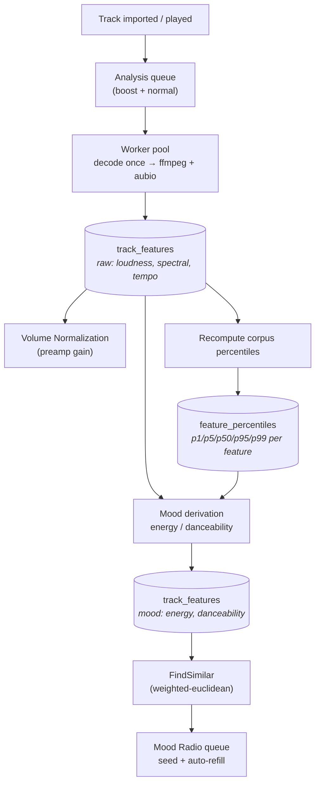
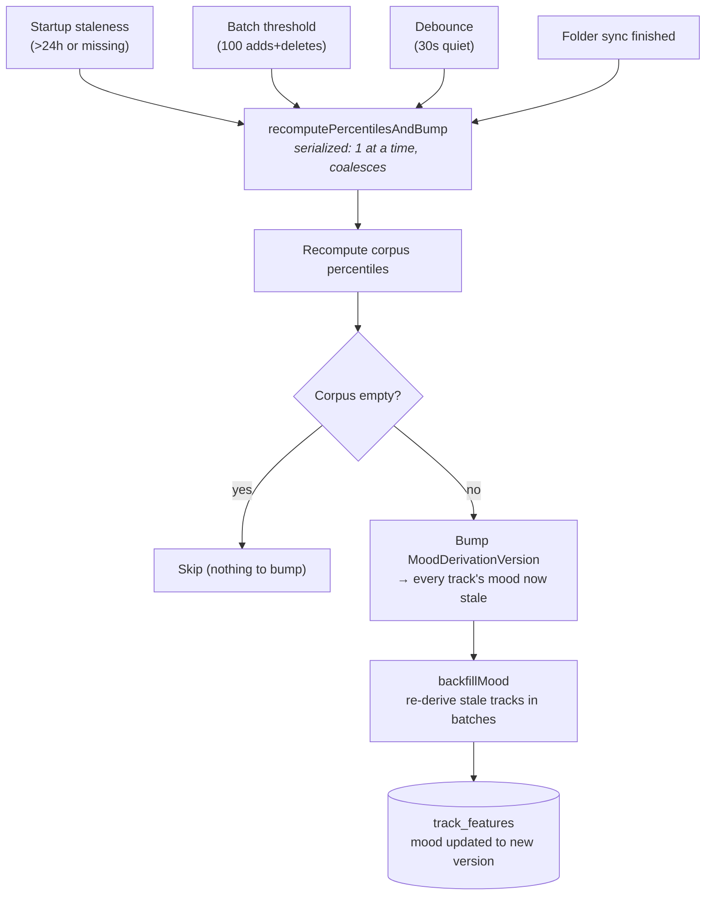

# Library Analysis

## Summary

Background pipeline that decodes each track once, runs an ffmpeg `libavfilter`
graph (`ebur128,aspectralstats,astats`) plus aubio tempo detection in-process
via cgo, and stores the result (loudness, dynamics, spectral features, tempo,
onset variance) in `track_features`. This is the sole data source for
[Volume Normalization](../normalization/README.md).
`energy`/`danceability` are derived from these raw features (rule-based, no ML,
normalized against corpus-wide percentiles — see Mood Derivation below) and
consumed by Mood Radio (see below).

The pipeline is **opt-in** (`AppSettings.LibraryAnalysisEnabled`, default `false`):
the worker pool exists only while enabled. Disabling it also force-disables
Normalization, since Normalization has no other source of loudness data.

## Aubio FFT Backend

The tempo/onset stage now vendors **FFTW3F** (`libfftw3f.a`) and builds aubio
with `--enable-fftw3f` via a vendored `pkg-config` manifest under
`internal/infra/audio/fftw3_libs/pkgconfig/<platform>/<arch>/fftw3f.pc`.
This keeps aubio on its single-precision ABI (`smpl_t=float`) while avoiding
the old Ooura fallback that forced process-wide serialization.

`ffmpeg_analyzer.h` no longer wraps aubio `new_/do_/del_` calls in an
application-global mutex. Concurrency is now limited only by the outer analysis
worker pool and aubio's own internal FFTW plan guards.

## Data Flow



Raw features feed two independent consumers: **Normalization** (loudness → gain)
and **Mood** (all features → energy/danceability, but only relative to the
corpus-wide percentile distribution). Mood then backs **Mood Radio** similarity.

## Files

| File | Purpose |
| ---- | ------- |
| `internal/app/analysis/analysis_service.go` | Worker pool, queue, enable/disable lifecycle, mood-derivation trigger |
| `internal/app/analysis/module.go` | FX module |
| `internal/app/analysis/mood/` | Mood formulas, percentile normalization, corpus percentile recompute |
| `internal/infra/wails/analysis_service.go` | Wails binding (`SetLibraryAnalysisEnabled`) |
| `internal/infra/wails/mood_radio_service.go` | Wails binding (`SeedMoodRadio`) |
| `internal/infra/audio/analyzer.go` + `ffmpeg_analyzer.h` | cgo adapter implementing `domain.LoudnessAnalyzer` |
| `scripts/build-fftw3-*.sh` + `scripts/build-aubio-*.sh` | Vendored FFTW3F/aubio builders for macOS, Linux, Windows |
| `internal/infra/sqlite/analysis_repository.go` | `track_features` CRUD, pending-count/list, `MarkFailed`, percentile table CRUD, mood-pending list |
| `internal/infra/sqlite/track_query_repository.go` | `FindSimilar` — weighted-euclidean nearest-neighbor query over energy/danceability/tempo, backs Mood Radio |
| `internal/domain/audio.go` | `LoudnessAnalyzer` interface |
| `internal/domain/models.go` | `TrackFeatures`, `FeaturePercentileRow`, `AppSettings.LibraryAnalysisEnabled`/`MoodDerivationVersion`, `AnalysisProgress` |
| `internal/domain/repositories.go` | `AnalysisRepository` (percentile/mood methods), `TrackQueryRepository` |
| `internal/infra/sqlite/settings_repository.go` | Persistence for `library_analysis_enabled`, `mood_derivation_version` |
| `internal/app/module.go` | Central wiring: import → enqueue, playback → throttle, on-play → boost, delete → mood-change notify |
| `frontend/src/stores/moodRadio.ts` | Mood Radio queue-seeding/auto-refill store |

## Settings (`AppSettings`)

| Field | Type | Default | Meaning |
| ----- | ---- | ------- | ------- |
| `LibraryAnalysisEnabled` | bool | `false` | Master on/off for the worker pool |

## Enable/Disable Lifecycle (`AnalysisService`)

- `Start(ctx)` (fx `OnStart`, called once): reads `LibraryAnalysisEnabled` from
  `domain.SettingsRepository` and calls `startPool()` if true. Otherwise the pool
  stays off until `SetEnabled(ctx, true)`.
- `SetEnabled(ctx, enabled bool) error`: persists the toggle, and **if disabling,
  also force-disables `NormalizationEnabled`** in the same settings write (cross-
  toggle — Normalization depends entirely on data this pipeline produces). Then
  starts or stops the pool to match.
- `startPool()`: spawns `max(NumCPU()/2, 1)` worker goroutines on a fresh
  `context.WithCancel`, then kicks off a one-time backfill (`ListPending` →
  `Enqueue` every pending track ID). Idempotent — no-op if already running.
- `stopPool()`: cancels the pool's context (workers exit `cond.Wait()` loops on
  next wake — cancel happens *before* the broadcast to avoid a race where a
  worker re-enters `Wait()` before observing cancellation), waits for in-flight
  analysis to finish (`wg.Wait()`), then **drops everything still queued**
  (not yet started) — disabling means disabled, not "finish the backlog". Dropped
  tracks are simply rediscovered by the next `startPool()`'s backfill.
- `Enqueue`/`BoostPriority`: no-op while the pool is disabled, so imports don't
  build an unbounded in-memory queue with nothing consuming it.
- `Stop(ctx)` (fx `OnStop`): unconditionally `stopPool()`.

## Queue / Worker Mechanics

Two queues (`boostQueue`, `normalQueue`) guarded by one `sync.Mutex` + `sync.Cond`.
Workers drain `boostQueue` first. Concurrency is governed by an `active`/`activeLimit`
counter (not a bool): `startPool()` sets `workersTotal = activeLimit = max(NumCPU()/2, 1)`.
`SetThrottled(true)` (driven by `PlayerService.AddStatusListener` — playback active)
lowers `activeLimit` via `throttledLimit(workersTotal)` instead of stopping dequeue
outright:
- `numCPU() <= 4`: `activeLimit = 0` — full pause; in-flight work still finishes.
- `numCPU() > 4`: `activeLimit = max(workersTotal/2, 1)` — a reduced pool keeps
  analyzing in the background alongside playback; fully pauses only when a track
  finishes and no slot is free.

`numCPU` is a package var aliasing `runtime.NumCPU`, overridable in tests.
`emitProgress` reports `state = paused` only when the resulting `activeLimit == 0`;
otherwise it stays `analyzing` even while throttled, since work is still progressing.

### Progress computation

`emitProgress` delegates `(total, state)` to the pure `resolveProgress(pending, done, state)`:

- `total = pending + done`.
- `state = done` iff `pending == 0`. Completion is keyed on the pending count, not
  `total` — `done` stays nonzero once any track has finished.
- `pending < 0` is the "`CountPending` failed" sentinel: `total` falls back to `done`
  alone, and `state` is left as the caller passed it (completion is unconfirmable
  without a real pending count).

### Failed tracks

A track whose `Analyze()` errors permanently (corrupt file, unsupported codec) is
recorded via `AnalysisRepository.MarkFailed(ctx, trackID, currentVersion)`, which
bumps `tracks.analyzed_version` **without** writing a `track_features` row:

- `GetFeatures` still returns nil → Normalization treats it as unanalyzed (gain 0).
- `CountPending`/`ListPending` stop counting it → `pending` can reach 0.
- It is counted in neither `pending` nor `done`, so `total` excludes it; 100% is
  reached once every *attemptable* track is resolved.

`analyzeOne` calls `MarkFailed` from the `Analyze()` error branch only — not from the
`ctx.Err() != nil` shutdown branch.

### Dedup and dequeue

Dedup via `queued`/`inFlight` maps: re-enqueuing an in-flight track is a no-op;
re-enqueuing a queued track with `priority=true` promotes it to `boostQueue`.

`Dequeue(trackIDs []string)` drops IDs from `boostQueue`, `normalQueue`, and the
`queued` dedup map, leaving `inFlight` untouched — an in-flight `Analyze()` finishes
rather than being cancelled mid-decode. Wired to library track deletion (see Central
Wiring) so a deletion racing an in-flight backfill does not keep analyzing and
`UpsertFeatures`-ing tracks being removed, which would contend with the deletion for
the single SQLite writer.

## Mood Derivation (`internal/app/analysis/mood/`)

`energy`/`danceability` are computed from raw `track_features` columns
(`rms`, `spectral_centroid`, `spectral_flux`, `tempo`, `crest`,
`onset_variance`, `loudness_range`) via locked formulas in `formulas.go`
(`DeriveEnergy`, `DeriveDanceability`) — weighted sums of each feature run
through `Normalize` (`mood.go`): hard-clamp to `[P1,P99]`, then a sigmoid
(`k=2.5`) of the value's distance from the corpus median in half-`(P95-P5)`
units. Danceability's tempo term instead uses `tempoScore`, a fixed
triangular function on raw BPM (0 at ≤60/≥180bpm, peaks at 1 at ~115bpm) —
not percentile-normalized, since tempo has a musically meaningful absolute
scale rather than a corpus-relative one.

The locked weights (all `Normalize` calls use `k=2.5`; `norm(x)` below is
`Normalize(x, pctl[x], 2.5)`):

```
energy       = 0.32·norm(rms)
             + 0.23·norm(spectral_centroid)
             + 0.17·norm(spectral_flux)
             + 0.18·norm(min(tempo, 180))   // tempo capped at energyTempoCap=180
             + 0.10·(1 − norm(crest))

danceability = 0.45·tempoScore(tempo)        // triangular, NOT percentile-normalized
             + 0.30·(1 − norm(onset_variance))
             + 0.15·(1 − norm(crest))
             + 0.10·(1 − norm(loudness_range))
```

Each weight set sums to 1.0, so both scores land in `[0,1]`. A `PercentileSet`
entry missing for a feature normalizes to a neutral `0.5` (degenerate-spread
branch), so a partial/empty warm cache still yields a valid score. Bump
`moodVersion` (`analysis_service.go`) on any weight/formula change.

`Normalize` needs a `PercentileSet` (`map[featureName]Percentile{P1,P5,P50,P95,P99}`)
computed across the whole analyzed library — a single track's raw features are
meaningless without a corpus to compare against. That set is:

- **Computed** by `RecomputeCorpusPercentiles` (`percentiles.go`): pulls every
  analyzed track's raw values via `AnalysisRepository.ListRawFeatureValues`,
  sorts and linearly interpolates p1/p5/p50/p95/p99 per feature (numpy's
  "linear" method), and persists via `UpsertFeaturePercentiles` into
  `feature_percentiles` (one row per feature, with `sample_count`/`computed_at`).
- **Cached** in-memory on `AnalysisService.moodPctl` (`loadPercentileCache`
  loads it at startup); hot-swapped by `recomputePercentilesAndBump` whenever
  recomputed, so in-flight derivations pick up the fresh table without
  blocking on a DB read per track.
- **Triggered** to recompute via three independent paths:
  1. **Startup staleness** (`maybeRecomputeOnStartup`): if the cached rows are
     older than `percentileStalenessThreshold` (24h) or don't exist yet,
     recompute once at `Start(ctx)`. This is the app's stand-in for a
     nightly-cron scheduler, since it's an offline desktop app that isn't
     always running.
  2. **Batch threshold**: `notifyMoodChange(n)` (called with `n=1` from
     `driveMoodDerivation` after each successful raw analysis, and
     `n=len(trackIDs)` from `NotifyTracksDeleted`) adds to a single combined
     `moodChangeCounter`; once it reaches `percentileRecomputeBatchSize`
     (100), a recompute fires immediately and the counter resets.
  3. **Debounce timeout**: every call to `notifyMoodChange` also (re)arms a
     `time.AfterFunc(percentileRecomputeDebounce, ...)` (30s). If no further
     add/delete event arrives before it fires, `fireDebouncedRecompute`
     recomputes with whatever's accumulated so far — bounds staleness for
     small batches instead of waiting indefinitely for the count to fill up.
     Adds and deletes share one counter/timer; the debounce timeout bounds
     staleness for sub-threshold batches.

All three trigger paths funnel into `recomputePercentilesAndBump`, which is
serialized: only one recompute runs at a time (`recomputeMu.TryLock`), and a
trigger that arrives mid-run sets a pending flag so exactly one more run
happens afterward against the latest corpus — concurrent triggers (e.g. a
sync-finished firing as the batch threshold trips) can't interleave the
version bump or run overlapping backfills.



After any recompute that yields a non-empty corpus, `settings.MoodDerivationVersion`
is bumped and every track's `tracks.mood_derived_version` becomes stale
relative to it. `backfillMood` then re-derives mood in batches
(`ListMoodPending` → `Derive` → `UpsertMoodFeatures`) for every stale track —
run as a plain sequential loop, not through the boost/normal worker pool,
since re-deriving from already-decoded features is cheap in-memory
arithmetic plus one `UPDATE`, unlike the expensive ffmpeg decode pass the
pool's concurrency/throttle knobs are tuned for.

`driveMoodDerivation` runs immediately after each track's raw analysis
succeeds: if `moodPctl` is already warm, it derives and persists that
track's mood right away (via `UpsertMoodFeatures`); if the cache is cold
(true cold start, no corpus yet), it's a no-op until the first recompute
backfills it.

## Mood Radio (`frontend/src/stores/moodRadio.ts`, `MoodRadioService`)

"Give me more like this" queue seeding/auto-refill, gated on
`AppSettings.LibraryAnalysisEnabled` (energy/danceability/tempo are its only
inputs). `MoodRadioService.SeedMoodRadio(seedTrackID, limit)` calls
`TrackQueryRepository.FindSimilar`, which ranks analyzed tracks by weighted-
euclidean distance over `energy`/`danceability`/`tempo` (tempo scaled `/200`
to bring its BPM range in line with the 0-1 normalized features), computed
entirely in SQL via correlated subqueries against the seed's own feature row,
excluding unanalyzed tracks and the seed itself. If the seed track itself has
no analyzed feature row, `FindSimilar` returns no results (rather than an
arbitrary order from NULL-valued distances).

The frontend store starts Mood Radio by seeding + prepending the seed track
(`FindSimilar` always excludes it), then auto-refills the queue as it drains
below `REFILL_THRESHOLD` (3) remaining tracks, appending `SEED_BATCH_SIZE` (15)
more similar tracks at a time and deduping against what's already queued.
Turning off Library Analysis mid-session stops the radio immediately (watched
reactively), since its only data source just went away.

## Central Wiring (`internal/app/module.go`)

To avoid a `library↔analysis` or `player↔analysis` import cycle, all cross-package
listeners are wired in one `fx.Invoke` block:

```go
lib.AddAnalysisListener(func(trackID string) { analysisSvc.Enqueue(trackID, false) })
lib.AddTrackDeletedListener(func(trackIDs []string) {
    analysisSvc.Dequeue(trackIDs)
    analysisSvc.NotifyTracksDeleted(trackIDs) // feeds the mood percentile batch/debounce trigger
})
playerSvc.AddStatusListener(func(status domain.PlayerStatus) {
    analysisSvc.SetThrottled(status.PlaybackState == domain.PlaybackStatePlaying)
})
playerSvc.AddTrackLoadListener(func(track *domain.TrackDTO) {
    analysisSvc.Enqueue(track.ID, true) // on-play priority boost
})
```

`AddTrackDeletedListener` (on `LibraryService`) fires with the IDs of tracks
just removed — from `RemoveWatchedFolder` (before the search-index/DB delete
loop, so the pool stops competing for the DB write as early as possible) and
from `SyncFolder`'s missing-file cleanup step (after `deletedIDs` is finalized,
alongside the existing `library:track-deleted` event emission). Files removed
from disk are detected on the next periodic sync scan, not instantly — see
[Library catalog](../library/README.md#periodic-sync-scheduler).

The on-play boost fires on **every** track load, whether or not the track is
already analyzed — `Enqueue`'s dedup tracks only in-flight/queued state, not
analysis freshness. `analyzeOne` therefore re-checks `AnalysisRepository.GetFeatures`
and returns early when `existing.AnalyzerVersion >= analyzerVersion`, before running
the ffmpeg pass, so replaying an already-analyzed track costs one `GetFeatures`
lookup rather than a full re-analysis.

## Wails-Exposed Methods (`AnalysisService`)

```go
SetLibraryAnalysisEnabled(enabled bool) error
```

Calls `AnalysisService.SetEnabled`, then `PlayerService.ReapplyNormalization()` —
needed either way: enabling doesn't change current playback, but disabling may
have just force-disabled Normalization, so the currently-playing track's preamp
gain must be cleared immediately.

## Events Emitted

| Event | Payload | When |
| ----- | ------- | ---- |
| `analysis:progress` | `{ done, total, state, libraryDone, libraryTotal }`, `state ∈ analyzing\|paused\|done` | On enable/disable, throttle change, and after each track finishes |

`done`/`total` track only the tracks pending in the current pool run; `libraryDone`/`libraryTotal` report library-wide analysis readiness (analyzed vs. all tracks). The library total is served from a short-TTL cache (`libraryTotalCached`, ~3s) so per-track `emitProgress` during a bulk scan doesn't issue a full-table `COUNT(*)` per row.

## Frontend

Settings → Playback tab, "Library Analysis" section directly above "Volume
Normalization" (`frontend/src/components/settings/PlaybackSettings.vue`): a single
enable switch with description text, plus the "Analyzing N/M (x%)" progress line,
shown while `libraryAnalysisEnabled && analysisState !== 'done'` (i.e. for both
`analyzing` and `paused`, so it stays visible across play/pause throttle changes).
State lives in `frontend/src/stores/app.ts` (`libraryAnalysisEnabled`). The
`updateLibraryAnalysisEnabled` action calls `AnalysisService.SetLibraryAnalysisEnabled`
and optimistically clears local `normalizationEnabled` when disabling, mirroring the
backend cross-toggle so the Normalization switch locks immediately without waiting on
a refetch. See `catalog/normalization/README.md` for the dependent UI.
