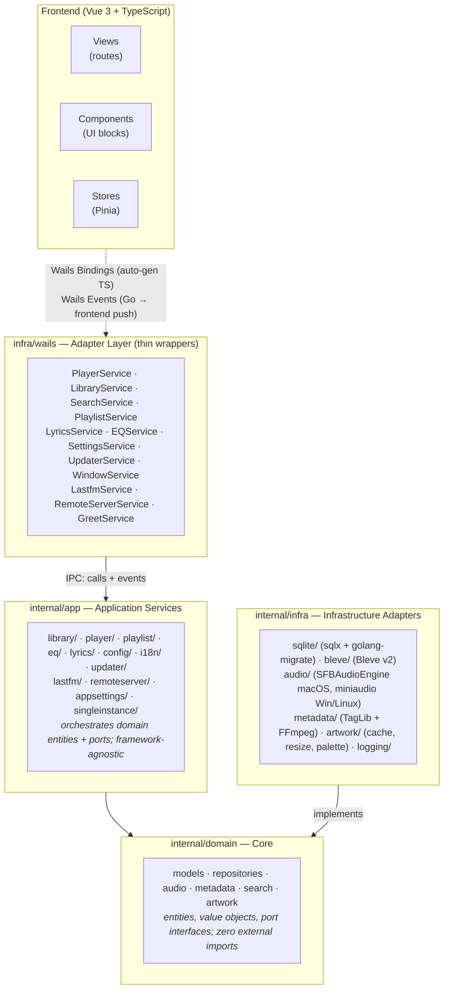
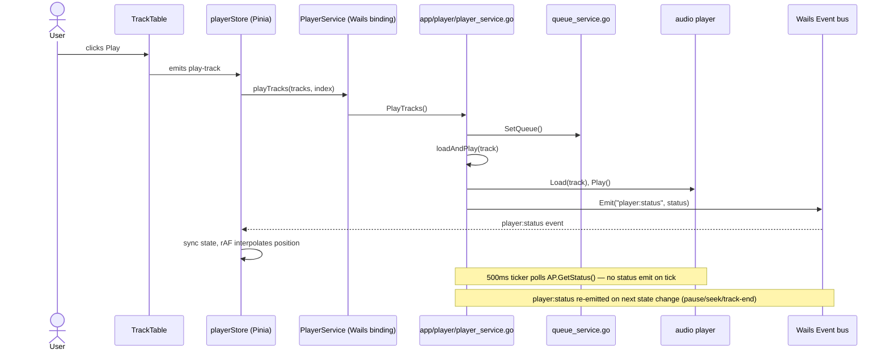

# Architecture Overview

## Summary

Airmedy is a desktop music player built with **Wails v3** (Go backend + Vue 3 frontend). The backend follows **Hexagonal (Ports & Adapters)** architecture with **Uber FX** dependency injection. The frontend is a Vue 3 SPA communicating with Go via Wails bindings and an event bus.

## Layer Diagram



## Dependency Rule

Dependencies flow strictly inward:

```
infra → app → domain
```

- `domain` imports nothing from `app` or `infra`
- `app` imports nothing from `infra`
- `infra` implements interfaces defined in `domain`

## Dependency Injection (Uber FX)

All wiring happens in `main.go` via `fx.New()`. Each package exposes an `fx.Module`:

```go
// main.go
fxApp := fx.New(
    app.Module,           // all application services
    // infra modules included transitively
    fx.Populate(
        &greetService,
        &libraryService,
        &playerService,
        &searchService,
        &playlistService,
        &lyricsService,
        &eqService,
        &windowService,
        &i18nService,
        &settingsService,
        &lastfmService,
        &updaterService,
        &artworkCache,
        &remoteServerService,
    ),
    fx.NopLogger,
)
```

No `cmd/` directory exists. The root `main.go` is the sole entry point.

## Wails v3 Integration

### Application Setup

```go
wailsApp := application.New(application.Options{
    Name:        "airmedy",
    Description: "A modern music player",
    Services: []application.Service{
        application.NewService(libraryService),
        application.NewService(playerService),
        // ...
    },
    Assets: application.AssetOptions{
        Handler: wails.NewAssetHandler(artworkCache),
    },
})
```

### Windows

**Main window:** 1280×800px (min 1060×768), macOS translucent titlebar hidden (InvisibleTitleBarHeight=50, Backdrop=Translucent, TitleBar=HiddenInset).

**Mini player window:** default 300×300px (min 280×140, max 500×500), hidden by default. Position, size, and pin (always-on-top) persist to the `mini_player_state` table and restore on open via `WindowService.ApplyMiniState`, clamped to the current screen's work area.

### Single Instance & Deep Links

`internal/app/singleinstance` enforces one running instance and relays later launches. It runs in
`main.go` **before** any exclusive resource is acquired (the bleve index lock, the remote-server
port) so a second launch never deadlocks on them.

- `Acquire` tries to become the primary by listening on a loopback TCP port derived from an
  fnv hash of an app key. If the port is already owned by a primary (verified via a magic
  handshake, `AIRMEDY_SI_V1`), it forwards this process's `os.Args` and returns
  `ErrAlreadyRunning` — the caller exits.
- On Windows/Linux the deep-link URL arrives in `os.Args`, so relaying the args hands the URL to
  the primary; the primary reads forwarded launches from `Instance.Messages()` and reacts
  (focus window / handle the URL).

### IPC: Frontend → Backend

Frontend calls Go methods via auto-generated TypeScript bindings in `frontend/src/bindings/`. Generated by `wails3 generate bindings` — never edit manually.

### IPC: Backend → Frontend (Events)

Go emits events via `application.EmitEvent(name, data)`. Frontend subscribes via Wails runtime event listener.

**App events:** `language:changed`

**Player events:** `player:status`, `player:queue-updated`, `player:theme`, `player:lyrics`

**Library events:** `library:sync-started`, `library:sync-progress`, `library:sync-finished`, `library:track-updated`, `library:updated`

**Playlist events:** `playlist:tracks-changed`

**Updater events:** `updater:progress` — payload `{ downloaded: number, total: number, percentage: number }`

## Data Flow: Playback Example



The audio player never emits events. The App-layer `PlayerService` emits
`player:status` via `application.EmitEvent` (`player_service.go`) only on discrete
state changes; the frontend interpolates the playback position locally with
`requestAnimationFrame` rather than from a 500ms server push.

## Asset Serving

Album artwork is served via a custom Wails asset handler (`infra/wails/assets.go`). The frontend requests artwork at a URL like `wails://artwork/{key}` or via relative path. The handler maps the key to a cached file path via `ArtworkCache.GetPath()` or `GetVariantPath()`.

## Remote Control Server

`internal/app/remoteserver` runs an opt-in LAN HTTP/WebSocket server so a phone or
another browser can control playback remotely. The Vue web client lives in `remote/`
(see monorepo table below).

- **Transport:** plain `net/http` server. `/ws` upgrades to a WebSocket (via
  `github.com/coder/websocket`); other paths serve REST-ish endpoints (`handleSettings`,
  `handleArtwork`).
- **Hub (`hub.go`):** tracks authenticated WebSocket clients and fans out state
  broadcasts to all of them.
- **Sessions (`session.go`):** per-client auth/state.
- The Wails adapter `RemoteServerService` (`infra/wails/remote_server_service.go`)
  exposes start/stop + status to the frontend.

## Storage Locations (XDG-compliant)

| Resource           | Path                                      |
| ------------------ | ----------------------------------------- |
| SQLite database    | `$XDG_DATA_HOME/airmedy/airmedy.db`       |
| Bleve search index | `$XDG_DATA_HOME/airmedy/airmedy.bleve`    |
| Artwork cache      | `$XDG_DATA_HOME/airmedy/artwork/`         |
| Log file           | `$XDG_DATA_HOME/airmedy/logs/airmedy.log` |

## Frontend Architecture

### Monorepo Structure

The frontend lives inside a **pnpm + Turbo monorepo** rooted at the repo root. Shared code is split into workspace packages:

| Package             | Path            | Purpose                                      |
| ------------------- | --------------- | -------------------------------------------- |
| `@airmedy/frontend` | `frontend/`     | Main desktop Vue 3 app (this app)            |
| `@airmedy/ui`       | `packages/ui/`  | Shared UI primitives (Radix Vue + Tailwind)  |
| `@airmedy/utils`    | `packages/utils/` | Shared utilities (`cn`, logger, test-utils)|
| _(remote)_          | `remote/`       | Browser-based remote control web app         |

`frontend/vite.config.ts` resolves `@airmedy/ui` and `@airmedy/utils` directly to their `src/` directories (no build step in dev). See `catalog/frontend-monorepo/` for full details.

**State:** Pinia stores (`stores/`) — single source of truth.

**Routing:** Vue Router with hash history, lazy-loaded views, nested routes for Artists/Genres/Composers.

**Styling:** TailwindCSS v4 with CSS custom properties for theming. Glass-morphism via `backdrop-filter: blur()`.

**Virtualization:** `vue-virtual-scroller` for track lists (56px rows).

**i18n:** `vue-i18n` with 12 locale files under `frontend/src/locales/`.

## Platform-Specific Notes

| Feature             | macOS                      | Windows/Linux         |
| ------------------- | -------------------------- | --------------------- |
| Audio backend       | SFBAudioEngine (cgo)       | miniaudio (C library) |
| EQ support          | AVAudioEngine EQ bands     | 10-band miniaudio chain|
| OS Now Playing      | `MPNowPlayingInfoCenter`   | Windows SMTC / Linux MPRIS (D-Bus) |
| Taskbar controls    | Not applicable             | Windows: thumbnail toolbar (`ITaskbarList3`, `infra/wails/thumbbar_*`) |
| App menu            | Full macOS menu bar        | File menu only        |
| Translucent window  | NSVisualEffectView         | Not applicable        |
| Title bar colour    | Hidden (translucent)       | Windows: `DwmSetWindowAttribute` (Linux n/a) |
| Single instance     | Wails default              | Loopback-socket guard + arg/deep-link relay (`singleinstance/`) |

## Native Build Artifacts (audio)

Pre-built native deps live under `internal/infra/audio/` and are generated by
`scripts/build-*.sh` (gitignored, produced by the build step — never committed):

| Artifact | Dir | Built by | Used by |
| --- | --- | --- | --- |
| FFmpeg static libs (`*.a`) | `ffmpeg_libs/<os>/<arch>/` | `build-ffmpeg-{darwin,linux,windows}.sh` | miniaudio player decode (Win/Linux) **+ in-process audio analysis (all platforms)**, linked via `cgoflags_*.go` |
| SFBAudioEngine xcframeworks | `sfb_libs/` | `build-sfbaudioengine-darwin.sh` | macOS player |

The ffmpeg static libs now include **`libavfilter.a`** with the `ebur128`, `aspectralstats`,
and `astats` filters (loudness / spectral / dynamics). The offline audio-analysis pipeline runs
these **in-process via cgo** (no separate binary shipped) — it builds an `abuffer → ebur128,
aspectralstats, astats → abuffersink` filter graph per worker and reads frame metadata.

Notably this adds ffmpeg to **macOS**, which previously had no ffmpeg dep (playback uses
SFBAudioEngine). `build-ffmpeg-darwin.sh` produces `ffmpeg_libs/darwin/{arm64,amd64}/*.a`; the
`audio` package links them alongside the SFBAudioEngine framework. Each analysis worker uses its
own `AVFilterGraph` + `AVCodecContext` (contexts are not shared across goroutines) so the worker
pool runs fully in parallel; set `thread_count = 1` per decode so pool concurrency, not
intra-decode threads, drives parallelism.
