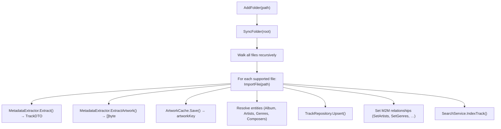
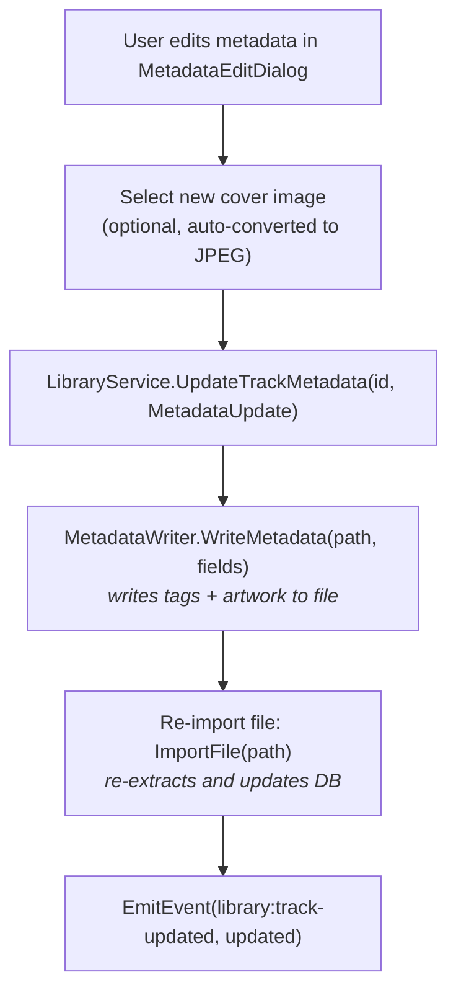

# Library Management

## Summary

The library feature manages the user's music collection: periodically rescanning watched
folders for changes, importing audio files, extracting metadata, persisting entities to
SQLite, and keeping the search index in sync.

## Entry Points

| Layer               | File                                      |
| ------------------- | ----------------------------------------- |
| Wails binding       | `internal/infra/wails/library_service.go` |
| Application service | `internal/app/library/service.go`         |
| Domain interfaces   | `internal/domain/repositories.go`         |
| SQLite adapters     | `internal/infra/sqlite/*_repository.go`   |
| Settings (interval) | `internal/app/appsettings/service.go`, `internal/domain/models.go` |

## Watched Folders

Users register directories via `AddFolder(path)`. The path is stored in the `watched_folders`
table.

```go
// WatchedFolder
type WatchedFolder struct {
    ID        string
    Path      string
    CreatedAt time.Time
}
```

Folders are not monitored by a real-time file-system watcher — a kqueue-based watcher (macOS)
holds one open file descriptor per watched *file*, which exhausts the process fd limit on
libraries with tens of thousands of tracks. Instead, changes are picked up by the periodic
sync scheduler (below), which reconciles added/changed/removed files on every run.

`artist.jpg/jpeg/png` files are picked up by the same scan and routed to artist-artwork
handling instead of the track pipeline. See the [Artwork catalog](../artwork/README.md#artist-artwork).

## Periodic Sync Scheduler

`LibraryService.runSyncScheduler(ctx)` runs for the lifetime of the app (started from
`LibraryService.Start`) and drives all folder rescans. Behavior is controlled by
`AppSettings.LibrarySyncInterval` (`domain.SyncInterval*` constants):

| Value      | Behavior                                          |
| ---------- | -------------------------------------------------- |
| `manual`   | Never auto-scans; user triggers via Sync Library.  |
| `launch`   | Scans once at startup only.                        |
| `15m` / `30m` / `1h` (default) | Scans at startup, then repeats every interval. |
| `15s`      | Dev-only fast interval for exercising the scheduler; hidden from the production settings UI (`VISIBLE_SYNC_INTERVALS` in `frontend/src/lib/librarySync.ts`) but always a valid stored value. |

The first scan is delayed 5s after `Start` so it doesn't contend with search-index/analysis
boot work. `LibraryService.RescheduleSync()` sends a non-blocking signal that makes the
scheduler re-read the interval immediately — wired in `internal/app/module.go` via
`SettingsService.AddChangeListener`, which fires whenever `LibrarySyncInterval` changes on
save (ignored if the save didn't touch that field).

Each scheduled run calls `SyncLibrary(ctx)` with a `withBackgroundSync(ctx)`-flagged context.
`isBackgroundSync(ctx)` gates the `library:sync-started` / `library:sync-progress` /
`library:sync-finished` events across `SyncFolder`, `ResplitLibrary`, and `ReindexAll` — a
periodic scan runs silently, with no progress dialog. Data-refresh events
(`library:updated`, `library:track-updated`, `library:track-deleted`) still fire, so views
reflect newly discovered changes without a manual reload. User-triggered syncs (Sync Library
button, Add Folder, Optimize Search) use a plain context and show the dialog as before.

## Import Pipeline



**Supported formats:** `.mp3`, `.flac`, `.m4a`, `.wav`, `.ogg`, `.opus`, `.aiff`, `.aif`, `.ape`, `.wv`, `.dsf`, `.dff`

> ALAC (Apple Lossless) uses the `.m4a` container — it is covered by `.m4a`, not a separate extension.

## Entity Resolution

To avoid duplicates, entities are identified by **normalization key** (lowercased, Unicode-folded, trimmed). IDs are deterministic MD5-based UUIDs generated from the seed string.

**Artist deduplication:** `NormalizationKey(name)` → lookup existing artist → upsert if not found.

**Album deduplication:** `NormalizationKey(title + primaryArtist)` → lookup → upsert. Album artwork is set from the first track that provides it.

**Multi-artist splitting:** Done in `buildEntitiesFromRaw(dto, settings)` (not in the extractor), reading the stored `Raw*Names` and splitting with the per-field user delimiters via `domain.SplitNames`. The multi-frame separator `domain.RawTagSeparator` (`"; "`) is always applied so genuinely separate tag frames stay separate. Default delimiters: `[";", "\\", ","]`. See [metadata catalog](../metadata/README.md).

## Delimiter-Aware Sync (`SyncLibrary`)

`SyncAll()` (Wails) runs `LibraryService.SyncLibrary(ctx)`:

1. Sync every watched folder (`SyncFolder`) — imports new/changed files, drops missing ones.
2. Compare a signature of the current delimiter settings (`delimitersSignature`, a JSON encoding
   of the 4 ordered lists) against the last-applied signature stored in `library_sync_state`.
3. **If changed:** `ResplitLibrary(ctx)` re-splits every track from its stored `Raw*Names` with
   the new delimiters and rebuilds entities/junctions (reuses `resolveEntities`, then
   `cleanupOrphanedEntities` + `CleanupOrphanedArtworks`), then `ReindexAll(ctx)` rebuilds the
   search index. The new signature is persisted **before** `ReindexAll` so the final
   `library:sync-finished` event reflects the applied state.
4. **If unchanged:** nothing extra (no re-split, no re-index).

The signature lives in DB, so "delimiters changed but not yet synced" survives an app restart.
`DelimitersPendingResync()` (Wails) returns `currentSignature != stored` — the UI uses it to
show a persistent "Sync Library to apply" hint and to clear it after sync (re-queried on every
`library:sync-finished`).

## Unchanged-File Skip & Forced Metadata Re-parse

`SyncFolder` preloads existing tracks' `(size, mtime)` under the walked root into an in-memory
map and skips re-extracting any file whose stamp still matches — this keeps repeat syncs of a
large, mostly-unchanged library fast.

That optimization is bypassed once, library-wide, whenever `currentMetadataSchemaVersion`
(`library/service.go`) is ahead of `library_sync_state.metadata_schema_version`: every file gets
re-parsed regardless of its stamp, so newly-added `TrackDTO` fields (e.g. `bit_depth`/`codec`,
added in migration 000039) get backfilled onto already-imported rows without a full reimport.
`SyncLibrary` persists the bumped version only after every watched folder has been synced, so a
library with multiple folders doesn't have one folder's completion silently skip the backfill for
the next. Bump `currentMetadataSchemaVersion` whenever the extractor (`taglib.go`) gains a field
that existing unchanged files need re-read to populate.

## Wails-Exposed Methods

```typescript
// Folder management
SelectFolder(): string                   // opens OS folder picker dialog
AddFolder(path: string): void
RemoveFolder(id: string): void           // optionally keeps tracks
GetWatchedFolders(): WatchedFolder[]
SyncAll(): void                          // SyncLibrary: re-scan folders + re-split if delimiters changed
ImportAll(): void                        // alias for SyncAll
ReindexAll(): void                       // rebuild Bleve index from DB
DelimitersPendingResync(): boolean       // current delimiter sig != last-applied sig
GetSyncStatus(): SyncProgress | null     // stub; used for frontend type generation
// Metadata & artwork
GetAlbumColors(id: string): ThemeColors
GetArtistColors(id: string): ThemeColors | null   // palette of artist's resolved artwork
GetArtistArtwork(artistID: string, eventID: string): string | null
SelectAndSetArtistArtwork(artistID: string): string   // pick file → manual artwork
RemoveArtistArtwork(artistID: string): void           // clear custom artwork
ToggleFavorite(trackID: string): boolean
UpdateTrackMetadata(trackID: string, update: MetadataUpdate): void
ShowInExplorer(trackID: string): void
// Track queries
GetAllTracks(): TrackDTO[]
GetTracksPaginated(offset, limit): TrackDTO[]
GetTracksByIDs(ids: string[]): TrackDTO[]       // preserves requested ID order
GetTrackCount(): number
GetTracksByAlbumID(albumID: string): TrackDTO[]
GetTracksByArtistID(artistID: string): TrackDTO[]
GetTracksByGenreID(genreID: string): TrackDTO[]
GetTracksByComposerID(composerID: string): TrackDTO[]
GetFavoriteTracks(): TrackDTO[]
GetRecentlyPlayedTracks(limit: number): TrackDTO[]
GetRecentlyAddedTracks(limit: number): TrackDTO[]
GetMostListenedTracks(limit: number): TrackDTO[]
GetLeastListenedTracks(limit: number): TrackDTO[]
// Album queries
GetAllAlbums(): AlbumDTO[]
GetAlbumByID(id: string): AlbumDTO
GetAlbumsByArtistID(artistID: string): AlbumDTO[]
GetRecentlyAddedAlbums(limit: number): AlbumDTO[]
// Artist / genre / composer queries
GetAllArtists(): Artist[]
GetArtistByID(id: string): Artist
GetAllGenres(): Genre[]
GetGenreByID(id: string): Genre
GetAllComposers(): Composer[]
GetComposerByID(id: string): Composer
```

## Events Emitted

| Event                   | Payload                    | When                     |
| ----------------------- | -------------------------- | ------------------------ |
| `library:sync-started`  | `{ total: number }`        | Before scan begins (user-triggered sync only; suppressed for periodic background scans) |
| `library:sync-progress` | `{ current, total, path }` | Per file imported (user-triggered sync only) |
| `library:sync-finished` | `{}`                       | Scan complete (user-triggered sync only) |
| `library:track-updated` | `TrackDTO`                 | Metadata written to file (fires for background scans too) |
| `library:updated`       | `{}`                       | General library change (fires for background scans too) |
| `artist-artwork-updated`| `{ artist_id, source, key }` | One artwork source's key changed (empty `key` = cleared) |

## Frontend Integration

**`useLibraryUpdates(tracks)` composable** listens for `library:track-updated` and `library:track-deleted` events and mutates the provided reactive array in-place, so all views stay current without re-fetching.

**Home overview** fetches `GetRecentlyPlayedTracks`, `GetMostListenedTracks`, and
`GetLeastListenedTracks` for carousel sections. The analytics tab uses
`GetTracksByIDs` to hydrate the ranked track IDs returned by `AnalyticsService`;
the binding preserves the supplied ordering.

**Settings → Library tab** (`LibrarySettings.vue`) renders three sections: watched folders list
with Add/Remove/Sync All/Optimize Search, a Rescan Interval section (`SYNC_INTERVALS` /
`VISIBLE_SYNC_INTERVALS` from `frontend/src/lib/librarySync.ts`), and delimiter configuration.

## Orphan Cleanup

After syncing, `AlbumRepository.DeleteOrphaned()`, `ArtistRepository.DeleteOrphaned()`, `GenreRepository.DeleteOrphaned()`, `ComposerRepository.DeleteOrphaned()` remove entities no longer referenced by any track. Artwork cleanup is handled by `ArtworkCache.CleanupOrphaned()` using the set of active artwork keys from `TrackRepository.GetAllArtworkKeys()`.

## Metadata Update Flow



## Play Count & Recently Played

`IncrementPlayCount(trackID)` is called by `PlayerService` on each track load. The `updated_at` timestamp on the track is used for recently-played ordering (`GetRecentlyPlayed` orders by `updated_at DESC`). `GetMostListened` orders by `play_count DESC`. `GetLeastListened` orders by `play_count ASC` (excluding zero plays).
