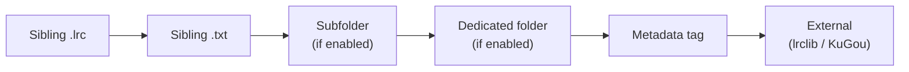
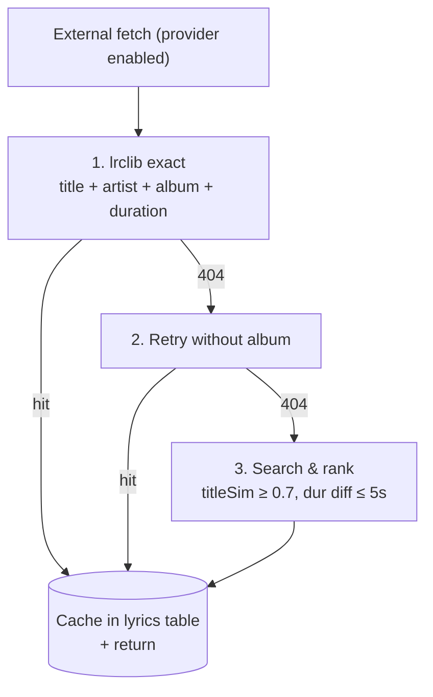

# Lyrics

## Summary

Fetches and displays synchronized (LRC) or plain-text lyrics for the current track. Lyrics are sourced from **sibling local files** (`.lrc` / `.txt` next to the audio file, read live at play time), an optional **subfolder next to the track** (gated by `lyrics_subfolder_enabled` + `lyrics_subfolder_name`, e.g. `<album>/lyrics/Song.lrc`), an optional **dedicated lyrics folder** (a single user-chosen folder searched by track basename, gated by `lyrics_folder_enabled`), embedded **file metadata** (`LYRICS` tag, read at scan time), and the external providers **lrclib.net** and **KuGou Music** (cached in SQLite). The frontend parses LRC timestamps and auto-scrolls to the current line.

## Files

| File                                        | Purpose                              |
| ------------------------------------------- | ------------------------------------ |
| `internal/domain/repositories.go`           | `LyricsProvider` + `LocalLyricsReader` port interfaces |
| `internal/app/lyrics/lyrics_service.go`     | Use-case orchestration, CRUD, racing, resolution, manual `.lrc` file save |
| `internal/app/lyrics/subfolder.go`          | `ValidSubfolderName` / `ResolveSubdir` — shared subfolder name validation and case-insensitive resolution, used for both read (`PlayerService`) and write (`LyricsService.SaveLyricsFile`) |
| `internal/infra/lyrics/local.go`            | Sibling `.lrc`/`.txt` file reader    |
| `internal/infra/lyrics/lrclib.go`           | lrclib.net HTTP adapter              |
| `internal/infra/lyrics/kugou.go`            | KuGou Music HTTP adapter             |
| `internal/infra/lyrics/module.go`           | FX wiring for provider group + local reader |
| `internal/infra/sqlite/lyric_repository.go` | SQLite persistence                   |
| `internal/infra/wails/lyrics_service.go`    | Wails binding                        |
| `frontend/src/composables/useLyrics.ts`     | LRC parser, synced/plain view        |

## Lyric Model

```go
type Lyric struct {
    TrackID     string
    Content     string    // LRC format or plain text from lrclib
    Source      string    // e.g., "lrclib-synced", "lrclib-plain"
    MetaContent string    // Lyrics extracted from file metadata
    MetaSource  string    // e.g., "metadata-synced", "metadata-plain"
    CreatedAt   time.Time
    UpdatedAt   time.Time
}
```

## Mobile Library Sync Cache

Mobile library-sync exports one **effective** lyric (`content` + `source`) per
track, never the raw provider and metadata variants together. Desktop stores
that result in `mobile_sync_lyric_cache` with an output `version` and an input
fingerprint. A new sync plan indexes candidate lyric directories once per
unique directory and fingerprints existing candidate files by size/mtime; it
only reads `.lrc`/`.txt` contents again when the fingerprint changes. The
first plan resolves every selected track. When provider lyrics are preferred
and cached provider content exists, local sidecars are skipped because they
cannot affect the exported result. This path never fetches online providers.

## Resolution Strategy

Resolution priority (default `prefer_local_lyrics=true`) — first hit wins:



`prefer_local_lyrics=false` flips it: external cached content is tried before the
local tier. The local tier (A→E above) is always evaluated as one unit.

`LyricsService.ResolveLyrics(ctx, trackID, audioPath, preferLocal bool, extraLyricsDir string)` picks the best lyric.

The **local tier** is built first: a local lyric file (read live by `LocalLyricsReader`, `.lrc`
preferred over `.txt`) — checked in the **sibling dir** of `audioPath` first, then each dir in
`extraDirs` in order — if present, otherwise the embedded metadata tag (`MetaContent`, cached in DB
at scan time). So within the local tier: **sibling file beats subfolder file beats dedicated-folder
file beats tag**.

`extraDirs` is built (in priority order) by `PlayerService.fetchAndEmitLyrics`:
1. `resolveLyricsSubdir(filepath.Dir(track.Path), lyrics_subfolder_name)` — when `lyrics_subfolder_enabled`
   and the name passes `validLyricsSubfolderName` (single segment, no separators or `..`).
   `resolveLyricsSubdir` matches the subfolder **case-insensitively** (exact `os.Stat` first, then a
   case-insensitive `os.ReadDir` scan of the track dir), so a name like `lyrics` finds a `Lyrics/`
   folder on case-sensitive filesystems (Linux) the same way macOS/Windows already would.
2. `lyrics_folder_path` — when `lyrics_folder_enabled` and non-empty.

Both `ResolveLyrics(ctx, trackID, audioPath, preferLocal, extraDirs...)` and
`HasLocalLyrics(ctx, trackID, audioPath, extraDirs...)` take the same variadic extra dirs.

`preferLocal` then decides local tier vs external provider content:

| Setting | Effect |
| --- | --- |
| `prefer_local_lyrics=true` | (Default) Use the local tier if available, otherwise fall back to `Content` (external provider). |
| `prefer_local_lyrics=false` | Use `Content` (external provider) if available, otherwise fall back to the local tier. |
| `lyrics_subfolder_enabled=true` | Also search `<track dir>/<lyrics_subfolder_name>` (flat, by basename) for `.lrc`/`.txt`, after the sibling dir. Name validated as a single safe path segment. Default off. |
| `lyrics_folder_enabled=true` | Also search `lyrics_folder_path` (flat, by basename) for `.lrc`/`.txt`, after the subfolder. Default off. |
| `enable_lrclib=false` | lrclib.net provider disabled; not queried on fetch. |
| `enable_kugou=false` | KuGou provider disabled; not queried on fetch. |

**Full priority (default `prefer_local_lyrics=true`):**
`Sibling .lrc` → `Sibling .txt` → `Subfolder .lrc` → `Subfolder .txt` (when `lyrics_subfolder_enabled`) →
`Folder .lrc` → `Folder .txt` (when `lyrics_folder_enabled`) → `Metadata tag` → `LRClib / KuGou`.

The setting was renamed from `prefer_metadata_lyrics` (migration `000022_prefer_local_lyrics`,
`RENAME COLUMN` preserves the existing value).

If both `enable_lrclib` and `enable_kugou` are false, no external fetch is attempted. If resolution returns no cached result and at least one provider is enabled, `PlayerService` triggers an external fetch.

### Local Lyric Files

- Filename must match the audio file's basename exactly, differing only in extension
  (`/music/Song.mp3` → `/music/Song.lrc` or `/music/Song.txt`).
- Searched in the audio file's **sibling dir** first, then each `extraDirs` entry in order:
  the **subfolder next to the track** (`<track dir>/<lyrics_subfolder_name>`), then the
  **dedicated lyrics folder**. All use the same basename match and are flat lookups (no recursion).
  Sibling dir always wins. An empty extra dir, or one equal to the sibling dir, is skipped
  (`internal/infra/lyrics/local.go`). The subfolder name is validated by `validLyricsSubfolderName`
  in `player_service.go` so it cannot escape the track directory, and resolved **case-insensitively**
  by `resolveLyricsSubdir` (so `lyrics` matches a `Lyrics/` folder on case-sensitive filesystems).
- Read **live at play time** in `PlayerService.fetchAndEmitLyrics` — not cached and not watched, so
  newly added/edited files are picked up on the next play. No rescan needed.
- Paths joined with `filepath.Join` → cross-platform (Unix `/`, Windows `\`).
- Sources: `local-lrc`, `local-txt`. Frontend keys synced/plain off the content (timestamps), so
  `.lrc` renders synced and `.txt` renders plain automatically.

### Manual `.lrc` File Save

`LyricsService.SaveLyricsFile(ctx, audioPath, content string) error` writes `content` as a
sibling `.lrc` file for `audioPath`, independent of the DB-backed `SaveLyrics` (which always
runs and only upserts the `lyrics` table row).

Candidate directories, in priority order:

1. Dedicated lyrics folder (`lyrics_folder_path`), when `lyrics_folder_enabled`.
2. Lyrics subfolder next to the track (`ResolveSubdir(trackDir, lyrics_subfolder_name)`),
   when `lyrics_subfolder_enabled` and the name passes `ValidSubfolderName`.
3. The track's own directory.

`SaveLyricsFile` first searches the candidates in that order for an existing `<base>.lrc`; if
found, it overwrites that file in place. If none exists, it creates a new one in the
highest-priority enabled candidate (creating the directory via `os.MkdirAll` if needed).

Exposed to the frontend as `LyricsService.SaveLyricsFile(audioPath, content)`. Invoked from
`FindLyricsDialog.vue` when the "Save .lrc file" checkbox is checked (default unchecked) at
the point the user clicks the result-selection button.

## Fetch Strategy

External fetch is a fallback chain — each step tries the next only on miss:



Synced (LRC-timestamped) results are preferred over plain text at every step.

### 1. Exact Fetch

Query `lrclib.net/api/get` with:

- `track_name` — cleaned title (see Title Cleaning below)
- `artist_name` — primary artist name
- `album_name` — album title
- `duration` — track duration in seconds

### 2. Fallback Without Album

If exact fetch returns 404, retry with `album_name` omitted (handles compilation albums where the song is listed under a different album).

### 3. Search and Rank

If both exact attempts fail:

1. `GET lrclib.net/api/search?q={title}+{artist}` → array of candidates
2. Score each candidate:
   - Title similarity ≥ 0.7 (normalized Levenshtein distance) — required threshold
   - Duration diff ≤ 5 seconds — required threshold
   - Final score: `titleSim × 0.5 + artistSim × 0.3 + durationScore × 0.2`
3. Select the highest-scoring candidate above thresholds.

### Title Cleaning

Before sending to lrclib, the title is normalized:

1. Lowercase
2. Trim whitespace
3. Collapse multiple spaces
4. Remove noise patterns (regex): `(feat.`, `[feat.`, `(official`, `[official`, `(live`, `(remaster`, etc.

### Synced vs. Plain Preference

Synced lyrics (with timestamps) are preferred over plain text. If only plain is available, `source` is set to `"lrclib-plain"`.

### KuGou Search and Rank

KuGou searches with `artist - title` and ranks the returned candidates with the same title, artist,
and duration scorer as lrclib. Candidates below the title-similarity threshold or more than 5 seconds
from the track duration are rejected; KuGou's provider score breaks ties. If no candidate qualifies,
the provider retries after removing bracketed metadata, then after swapping title and artist.

## Ports

```go
type LyricRepository interface {
    GetByTrackID(ctx, trackID string) (*Lyric, error)
    Save(ctx, lyric *Lyric) error
    Upsert(ctx, lyric *Lyric) error
    Delete(ctx, trackID string) error
}

type LyricsProvider interface {
    Fetch(ctx context.Context, track *TrackDTO) (*Lyric, error)
    Name() string
}

// LocalLyricsReader reads a local lyric file by the audio file's basename
// (<base>.lrc preferred, then <base>.txt). The sibling dir is checked first,
// then each extraDir in order (skipping empty / sibling-equal dirs).
// found=false if none exist.
type LocalLyricsReader interface {
    Read(audioPath string, extraDirs ...string) (content, source string, found bool)
}
```

Lyrics are stored in the `lyrics` table. It maintains both `content`/`source` (from external providers) and `meta_content`/`meta_source` (from file metadata).

## Provider Adapters

Providers live in `internal/infra/lyrics/` and implement `domain.LyricsProvider`. They return `*domain.Lyric` with content populated but **not persisted** — `LyricsService` calls `saveLyric` after receiving a result.

| Provider | Name() | Endpoint |
|----------|--------|---------|
| `LrclibProvider` | `"lrclib"` | `https://lrclib.net/api/` |
| `KugouProvider` | `"kugou"` | `http://krcs.kugou.com/search` + `https://lyrics.kugou.com/download` |

Providers are wired via FX value group `lyrics_providers`. `LyricsService` receives `[]domain.LyricsProvider` and filters by name based on enabled flags.

## Wails-Exposed Methods

```typescript
GetLyrics(trackID: string): Lyric | null
FetchLyrics(trackID: string, track: TrackDTO): Lyric | null
PlayerService.GetCurrentLyrics(): LyricsEvent | null
PlayerService.RefreshCurrentLyrics(): number
SaveLyrics(trackID: string, content: string, source: string): void
SaveLyricsFile(audioPath: string, content: string): void
DeleteLyrics(trackID: string): void
```

`GetLyrics` returns the cached DB entry. `FetchLyrics` always hits the network and currently queries both providers regardless of `enable_lrclib`/`enable_kugou` settings (known limitation — manual refresh bypasses provider toggles).

## Event Delivery

On track load (and when the current track is manually refreshed), `PlayerService` creates a
monotonic request ID, cancels the preceding lyric context, and uses a 35-second total deadline.
It emits a lifecycle event:

```
player:lyrics → { track_id, request_id, state: "loading" | "ready" | "error", lyric?: Lyric }
```

`PlayerStatus.lyrics_request_id` identifies the currently expected request before the terminal
event arrives. Delivery of the status and lyric event is independent, so the player store accepts
the same-track event when its request ID is equal to or newer than the latest seen ID, and ignores
only older IDs; a late older status likewise cannot restore loading after a newer terminal event.
`error` ends loading without clearing an already displayed lyric. `PlayerService` stores the latest
`loading` / `ready` / `error` event for the active request, and `GetCurrentLyrics` returns that
lifecycle snapshot rather than independently re-resolving the database as an always-`ready`
result. The frontend accepts a snapshot whose request ID is equal to or newer than the latest ID it
has observed. While loading, it reconciles the snapshot every 250 ms (with a 36-second UI
failsafe), so a first online request whose terminal Wails event is lost while the event bridge is
starting still reaches `ready` or `error`. Older snapshots are discarded and cannot overwrite a
newer request.
When the status and `ready` event arrive in the same browser tick, the track-change watcher keeps
a lyric whose `track_id` already matches the new track; this prevents Vue's deferred watcher flush
from clearing a successfully resolved automatic lyric.

## LRC Format Parser (`useLyrics.ts`)

**LRC format:**

```
[MM:SS.ms]Lyric text here
[01:23.45]Another line
```

### Parsed Types

```typescript
interface LyricLine {
  text: string;
  secondary?: string; // bilingual: text after "^" or "/"
  time: number; // seconds (float)
}

interface PlainLine {
  primary: string;
  secondary?: string;
}
```

### Immersive Fullscreen Rendering

When fullscreen High Contrast Lyrics is off, `ImmersiveLyricsPanel` passes
`immersive=true` to `PlayerLyrics`. For synced lyrics, `SyncedLyricsView` keeps
the active line sharp; its immediate neighbors have only a `0.35px` blur, then
lines farther away use `1.25px` and `2px` blur while fading from 25% to 10%
opacity. The active line retains the existing 105% scale. The
high-contrast fullscreen panel and `LyricsDrawer` retain their existing styling.
Immersive auto-scroll positions the active line at 32% of the lyric viewport;
other lyric surfaces keep it centered.

### `isSynced` Detection

Checks if `content` contains at least one valid LRC timestamp pattern: `[MM:SS.ms]`.

### Bilingual Support

Lines can contain bilingual text separated by `^` or `/`:

```
[01:23.45]English text ^ 中文翻译
```

Parsed into `{ text: "English text", secondary: "中文翻译" }`.

## Frontend Display

**`LyricsDrawer.vue`** and the fullscreen `SyncedLyricsView` render lines with active-line highlighting. Their synced view follows playback by default: the first valid layout positions the active line immediately, then subsequent transitions use smooth scrolling only while the previous active line remains visible. Scrolling or dragging the lyric surface enters browse mode, stopping follow and making every line fully readable (no fade or blur). Tapping a line seeks to it and resumes follow. If fullscreen lyrics is mounted while its right column is still collapsed, a `ResizeObserver` waits for the first non-zero layout before positioning the active lyric.

**View selection:** Tracks with synchronized lyrics always use the synced view; browse mode makes the complete text readable without switching modes. Tracks with only plain lyrics use the plain-text view.

**Fullscreen player:** Lyrics panel shown as the right column or via tab in the fullscreen overlay.

**Refresh button:** For the current track, the context menu calls `PlayerService.RefreshCurrentLyrics()` so it uses the same request-ID lifecycle as automatic loading. Other selected tracks still call `FetchLyrics()` only to refresh their cache.

**Manual Search:** In the track context menu (`context_menu.find_lyrics`), opens `FindLyricsDialog.vue`. This allows users to manually search for lyrics by title and artist. It provides a list of candidates from both LRCLIB and KuGou, scored using the same "Search and Rank" logic as the automatic fetch. Users preview a candidate and confirm via the "Select" button, which always upserts the DB row (`SaveLyrics`) and, if the "Save .lrc file" checkbox is checked, also calls `SaveLyricsFile` (see Manual `.lrc` File Save above). An info icon next to the checkbox shows a hover tooltip (`Tooltip` component, `@airmedy/ui`) explaining the save-location priority.

For the currently playing track, the dialog then calls `PlayerService.PublishCurrentLyrics`. This advances the lyric request ID, cancels any in-flight automatic lookup, and emits the selected lyric as `ready`; a late provider response therefore cannot overwrite or hide the manual selection.

**Manual Edit:** Users can manually edit lyrics in the `MetadataEditDialog`. These edits are written to the file's `LYRICS` tag and stored as `meta_content` in the database.
