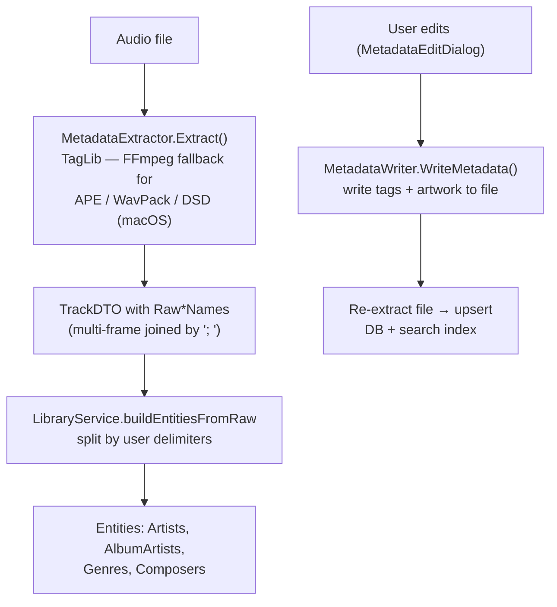

# Metadata Extraction & Writing

## Summary

The metadata feature handles reading audio file tags (ID3, Vorbis, MP4/iTunes, etc.) via TagLib, normalizing raw strings, resolving entity relationships, and writing user edits back to files.

## Files

| File                                     | Purpose                                       |
| ---------------------------------------- | --------------------------------------------- |
| `internal/infra/metadata/taglib.go`      | TagLib integration — extract and write        |
| `internal/domain/metadata.go`            | MetadataExtractor / MetadataWriter interfaces |
| `internal/domain/metadata_processing.go` | String normalization, delimiter-based name splitting (`SplitNames`, `DefaultDelimiters`, `ValidateDelimiters`, `RawTagSeparator`) |

## Data Flow



Extraction never splits names — it only fills `Raw*Names`; the entity split runs
once in `buildEntitiesFromRaw`, so import and re-sync share one code path.

## MetadataExtractor Interface

```go
type MetadataExtractor interface {
    Extract(ctx context.Context, path string) (*TrackDTO, error)
    ExtractArtwork(ctx context.Context, path string) ([]byte, string, error)
    ExtractLyrics(ctx context.Context, path string) (content string, isSynced bool, err error)
}
```

**Library:** `github.com/misa198/go-taglib` — fork of `go.senan.xyz/taglib` (Go bindings to the TagLib C++ library), extended to expose `BitDepth` (bits per sample) and `InnerCodec` (codec inside a container format, e.g. m4a `aac`/`alac`), which upstream doesn't surface. Feeds `Track.BitDepth`/`Track.Codec`, used by the frontend to classify Lossy/Lossless/Hi-Res/DSD (see `catalog/library` for the audio-quality tiering and the re-sync backfill mechanism).

## Tag Mapping Strategy

TagLib exposes a flat tag map. The extractor tries multiple keys (ID3v2, Vorbis comments, iTunes/MP4) for each field:

| Field        | Tag keys tried                |
| ------------ | ----------------------------- |
| Title        | `TITLE`                       |
| Artist       | `ARTIST`, `TPE1`, `©ART`      |
| Album Artist | `ALBUMARTIST`, `TPE2`, `aART` |
| Album        | `ALBUM`                       |
| Genre        | `GENRE`, `TCON`               |
| Composer     | `COMPOSER`, `TCOM`            |
| Year         | `DATE`, `YEAR`, `TDRC`        |
| Track Number | `TRACKNUMBER`, `TRACK`, `TRKN`|
| Disc Number  | `DISCNUMBER`, `DISC`, `TPOS`  |
| BPM          | `BPM`, `TBPM`, `tmpo`         |
| Label        | `LABEL`, `PUBLISHER`, `TPUB`  |
| ISRC         | `ISRC`, `TSRC`                |
| Copyright    | `COPYRIGHT`, `TCOP`, `cprt`   |
| Lyrics       | `LYRICS`                      |

Values like `"3/12"` (track/total) are parsed to extract both the number and total.

## Artwork Extraction

`ExtractArtwork()` returns raw bytes and MIME type. MIME is detected from the data header if the tag doesn't specify it. The caller (`library/service.go`) passes these to `ArtworkCache.Save()`.

## Normalization Functions (`metadata_processing.go`)

### `NormalizationKey(s string) string`

Used for entity deduplication. Produces a stable, comparable key:

1. Lowercase
2. Trim leading/trailing whitespace
3. Collapse multiple spaces
4. `FoldUnicode()` — remove diacritics

Example: `"Björk"` → `"bjork"`, `"The Beatles"` → `"the beatles"`

### `NormalizeSort(s string) string`

Used for `sort_title` / `sort_name` — produces a user-friendly sort key:

1. Remove leading articles: `"The "`, `"A "`, `"An "`
2. `FoldUnicode()`
3. Remove leading punctuation
4. Pad embedded numbers to 4 digits (e.g., `"Track 2"` → `"Track 0002"`)

### `FoldUnicode(s string) string`

NFKD decomposition to separate base characters from diacritics, then strips non-spacing marks. Special case: `đ` → `d` (Vietnamese).

### `SplitNames(s string, delimiters []string) []string`

Splits a concatenated value into individual names using **user-configurable delimiters**
(no hardcoded keyword/regex logic). Each delimiter is a literal separator substring; results
are trimmed, empties dropped, deduplicated case-insensitively. An empty `delimiters` slice
returns the whole trimmed string as one name (splitting disabled).

- `DefaultDelimiters() []string` → `[";", "\\", ","]` (the built-in default).
- `ValidateDelimiters(list []string) error` — empty list allowed (means "do not split");
  rejects empty/whitespace-only entries, duplicates, and entries longer than 5 chars.

Example (default): `"Artist A; Artist B, Artist C"` → `["Artist A", "Artist B", "Artist C"]`.
`"Earth, Wind & Fire"` with only `[";", "\\"]` → `["Earth, Wind & Fire"]` (comma not configured).

### Where splitting happens (single source of truth)

The extractor (`taglib.go`) does **not** split — it only fills the `Raw*Names` display fields
(`allTags(... domain.RawTagSeparator ...)`, joining multiple same-named frames with `"; "`).
The actual entity split runs in `LibraryService.buildEntitiesFromRaw` (`library/service.go`),
using the per-field delimiters from `AppSettings`. This unifies import and re-sync (both read
the stored `Raw*Names`).

**Multi-frame guarantee:** `buildEntitiesFromRaw` always prepends `domain.RawTagSeparator`
(`"; "`) to the user delimiters, so two separate `ARTIST` frames always yield two artists
regardless of the user's delimiter config. The user delimiters only further split *within* a
frame.

Per-field delimiter settings: `ArtistDelimiters`, `AlbumArtistDelimiters`, `GenreDelimiters`,
`ComposerDelimiters` (see `catalog/settings` and `catalog/library` for the re-sync flow).

## MetadataWriter Interface

```go
type MetadataWriter interface {
    WriteMetadata(ctx context.Context, path string, fields MetadataUpdate) error
}
```

### MetadataUpdate

```go
type MetadataUpdate struct {
    Title       string
    Artist      string
    AlbumArtist string
    AlbumTitle  string
    Genre       string
    Composer    string
    Year        int
    TrackNumber int
    TotalTracks int
    DiscNumber  int
    TotalDiscs  int
    BPM         int
    Label       string
    ISRC        string
    Lyrics      string
    ArtworkData []byte
    ArtworkMIME string
}
```

After writing tags and optional artwork, `library/service.go` re-extracts the file and upserts the updated track to DB and search index.

### Editing the Current Track During Playback

Writing tags can rewrite the media container, so the Wails metadata binding
stops a currently playing or paused track before calling `WriteMetadata()`.
After re-import completes, it reloads the track through `PlayerService` using
the fresh DTO. A playing track resumes at its prior position (clamped to a
shorter updated duration); paused and stopped tracks retain their state.
If the user selected a different track while the write was in progress, the
new playback is left untouched.

## Raw Metadata Storage

All extracted tags are serialized as JSON and stored in `tracks.other_metadata` (TEXT column). This allows future migrations to re-parse additional fields without re-scanning files.

## Supported Formats

TagLib handles: MP3 (ID3v1/v2), FLAC (Vorbis), M4A/AAC (iTunes atoms), WAV, OGG, Opus, AIFF. For formats TagLib cannot decode (APE, WavPack, DSD), FFmpeg is invoked as a fallback decoder on macOS. On Windows and Linux, FFmpeg is the primary decoder for all formats to ensure consistent and high-performance playback.
