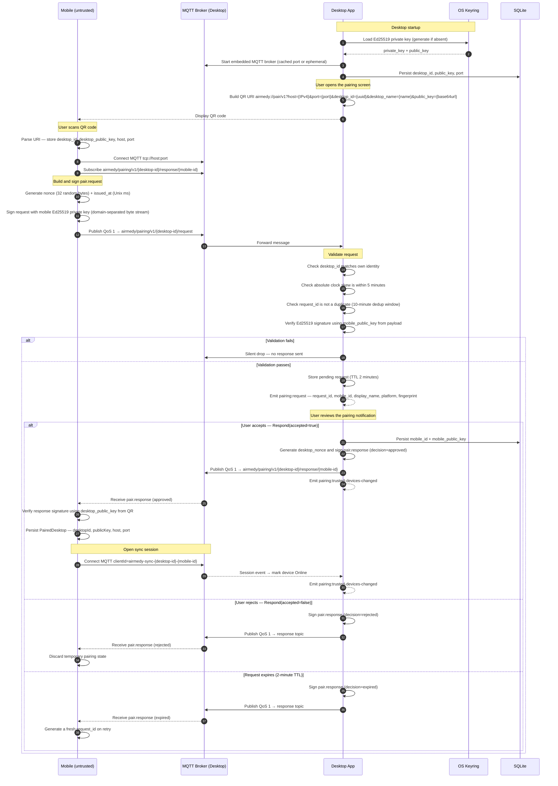
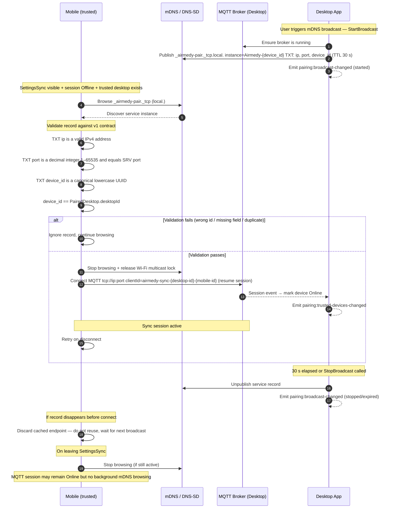
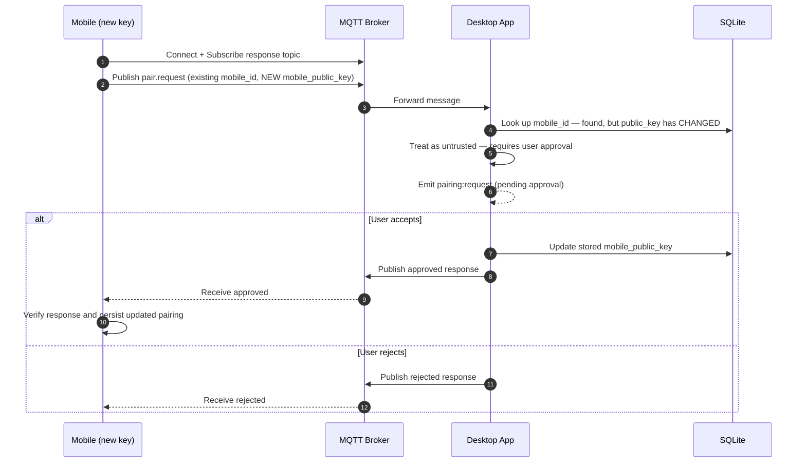
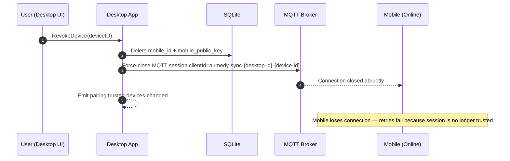

# Mobile Pairing Protocol v1

## Summary

The desktop application starts an embedded MQTT broker whenever it starts. This
protocol establishes a trusted Ed25519 public-key relationship between one desktop
and one mobile device. It does **not** authorize or carry playback commands yet.

Desktop private keys are stored only in the OS keyring. The desktop identity and
accepted mobile public keys are stored in SQLite. Removing a trusted device deletes
its authorization immediately and force-closes its active MQTT sync session.

## Desktop IPC

`MobilePairingService` exposes these Wails methods to the desktop frontend:

| Method | Result |
| --- | --- |
| `GetStatus()` | Broker state used internally to build the pairing QR, desktop ID/public key, and LAN addresses |
| `Retry()` | Retries identity/broker startup after an unavailable status |
| `GetTrustedDevices()` | Accepted mobile devices with public-key fingerprints |
| `Respond(requestID, accepted)` | Accepts or rejects a pending verified request |
| `RevokeDevice(deviceID)` | Deletes a trusted mobile identity and disconnects its live MQTT sync session |

The backend emits `pairing:request` with `request_id`, `mobile_id`,
`display_name`, `platform`, and fingerprint after a valid untrusted request. The
frontend subscription is owned by `mobilePairing.ts` and always disposed on app
unmount. After acceptance or revocation, the Wails adapter emits
`pairing:trusted-devices-changed`; `MobileDevicesSettings.vue` reloads its trusted
device list from this event and disposes the listener when unmounted. Trusted
device rows, including their trailing context-menu button, open a shared menu;
revocation is a destructive `Delete` item in that menu rather than a direct row
action.

## Desktop mDNS broadcast

`MobilePairingService` exposes `StartBroadcast()` and `StopBroadcast()`.
Starting a broadcast first ensures the embedded broker is running, then publishes
`_airmedy-pair._tcp.local.` for at most 30 seconds. The adapter emits
`pairing:broadcast-changed` whenever it starts, stops, expires, or is cleaned up
during desktop shutdown. `GetStatus()` includes `broadcasting` and
`broadcasting_until` for rendering the countdown.

### Mobile discovery contract (v1)

This is discovery for an **already trusted desktop only**. A mobile must not use
an mDNS record to pair a new desktop: the record deliberately does not contain
the desktop public key, so QR remains the bootstrap and identity-verification
mechanism for first pairing.

1. Browse DNS-SD service type `_airmedy-pair._tcp` in the `local.` domain only
   while the user has explicitly initiated discovery.
2. Resolve the service, read its SRV port and TXT fields, then require all of
   the following before connecting:
   - TXT `ip` is a syntactically valid IPv4 address.
   - TXT `port` is a decimal integer in `1..65535` and equals the SRV port.
   - TXT `device_id` is a canonical lowercase UUID.
   - `device_id` matches the mobile's already stored `PairedDesktop.desktopId`.
3. Open the existing plain MQTT connection to `ip:port` and resume the existing
   `airmedy-sync-<desktop-id>-<mobile-id>` session. The saved desktop public key
   remains the authority for future signed pairing responses; mDNS never
   replaces or updates it.
4. Ignore malformed, incomplete, duplicate-ID, unknown-device, expired, or
   disappeared records. Do not cache an advertised endpoint after its service
   record disappears; a later broadcast is authoritative.

The service instance is `Airmedy-<device_id>`. Its DNS-SD SRV record carries the
same MQTT port supplied in TXT. TXT has exactly these UTF-8 `key=value` fields:

| Key | Value |
| --- | --- |
| `ip` | Desktop's selected reachable IPv4 address |
| `port` | Decimal MQTT port |
| `device_id` | Canonical lowercase desktop UUID |

Mobile clients should ignore unknown TXT keys for forward compatibility, but
must not infer a public key, display name, authorization, or command channel from
this record. mDNS is endpoint discovery only; it does not alter the signed QR
pairing protocol.

### Android discovery lifecycle

Android starts DNS-SD browsing only while `SettingsSync` is visible, a trusted
desktop exists, and its MQTT session is Offline. It validates each resolved
record with the v1 contract, connects only to the matching trusted desktop, and
stops browsing (including its Wi-Fi multicast lock) once MQTT is Online or the
screen is left. Broadcast endpoints remain in memory and are never persisted;
if an advertised record disappears, its endpoint is not used for a later
reconnect. An already-open MQTT session may remain connected after leaving the
screen, but mobile never performs mDNS discovery in the background. Android's
saved QR route is attempted once at app start and does not retry in the
background after a failed or lost connection.

## Discovery QR

The QR text is a URI with this exact shape:

```text
airmedy://pair/v1?host=<IPv4>&port=<decimal>&desktop_id=<lowercase-uuid>&desktop_name=<percent-encoded-UTF-8>&public_key=<base64url-no-padding>
```

`public_key` is the raw 32-byte desktop Ed25519 public key encoded with unpadded
base64url. The QR has one selected LAN IPv4 address. Mobile stores the desktop ID
and public key after scanning, then connects to `mqtt://host:port`.

`desktop_name` is a local display label only. Desktop derives it from the OS hostname,
validates it as 1–64 UTF-8 bytes without NUL, CR, or LF, and falls back to
`Airmedy Desktop`. Its query value is UTF-8 percent-encoded. Mobile must accept
older QR payloads without this field and display `Airmedy Desktop`; this value is
never included in authentication or signature verification.

## MQTT transport

The broker reuses the cached `AppSettings.PairingMQTTPort` when it is available;
otherwise it listens on `0.0.0.0:0`, caches the selected operating-system port,
and advertises it in the QR. If the cached port is unavailable, it falls back to a
new ephemeral port and updates the cache. It supports MQTT 3.1.1 and MQTT 5 over plain TCP. TLS is deliberately
out of scope for v1: signed payloads authenticate the peers, but LAN observers can
read, delay, or drop messages.

Only these non-retained QoS 1 topics are allowed:

| Direction | Topic |
| --- | --- |
| Mobile → desktop | `airmedy/pairing/v1/<desktop-id>/request` |
| Desktop → mobile | `airmedy/pairing/v1/<desktop-id>/response/<mobile-id>` |

Payloads must be UTF-8 JSON of at most 16 KiB. MQTT sessions are not persisted.
Mobile must subscribe to its response topic before publishing a request and remain
connected until it receives a response. A reconnect after no response creates a new
request ID; clients must not reuse expired or rejected IDs.

After an approved pairing, Android retains the verified QR host and port and keeps
a separate MQTT client session open for the lifetime of its Sync ViewModel. During
an active library transfer, the Android `dataSync` foreground service takes over
the MQTT connection so it can continue in the background and publish receipts.
Its
client ID is `airmedy-sync-<desktop-id>-<mobile-id>`, enabling desktop to mark the
matching trusted device Online or Offline from broker session events; it retries
after a disconnect. An Offline transition cancels that device's in-progress
library plan preparation or supersedes its active plan. This session has no
publish/subscribe command topics yet; library sync uses the separately versioned,
authenticated topic namespace defined in the [sync catalog](../sync/README.md).

## Handshake messages

All binary values use unpadded base64url. UUIDs use canonical lowercase form.
`issued_at` is Unix epoch milliseconds. Mobile names are 1–64 UTF-8 bytes and
platform values are 1–32 UTF-8 bytes; neither may contain NUL, CR, or LF. Defined
platform labels are `Android`, `iOS`, and `iPadOS` (with exactly this casing).

```json
{
  "version": 1,
  "type": "pair.request",
  "request_id": "uuid",
  "desktop_id": "uuid",
  "desktop_public_key": "32-byte base64url key",
  "mobile_id": "uuid",
  "mobile_name": "My iPhone",
  "mobile_platform": "ios",
  "mobile_public_key": "32-byte base64url key",
  "nonce": "32-byte base64url nonce",
  "issued_at": 0,
  "signature": "64-byte base64url Ed25519 signature"
}
```

```json
{
  "version": 1,
  "type": "pair.response",
  "request_id": "uuid",
  "decision": "approved",
  "desktop_id": "uuid",
  "desktop_nonce": "32-byte base64url nonce",
  "issued_at": 0,
  "signature": "64-byte base64url Ed25519 signature"
}
```

`decision` is exactly `approved`, `rejected`, or `expired`.

### Signing input

JSON is never signed directly. Each item is appended to a byte stream in the stated
order: UTF-8 strings and binary values are prefixed with their unsigned 16-bit
big-endian length; `version` is one unsigned byte; `issued_at` is signed 64-bit
big-endian. Keys/nonces are decoded to raw bytes before appending.

Request input order:

```text
"airmedy.mobile-pairing.request.v1", version, "pair.request", request_id,
desktop_id, desktop_public_key, mobile_id, mobile_name, mobile_platform,
mobile_public_key, nonce, issued_at
```

The mobile signs this input with its Ed25519 private key.

Response input order:

```text
"airmedy.mobile-pairing.response.v1", version, "pair.response", request_id,
decision, desktop_id, desktop_public_key, mobile_id, mobile_public_key,
request_nonce, desktop_nonce, issued_at
```

The desktop signs this input with its Ed25519 private key. Mobile verifies it using
the public key stored from the QR.

## Desktop behavior

1. Reject malformed messages, wrong desktop identity, invalid signatures, and
   requests with an absolute clock skew over five minutes without a response.
2. De-duplicate request IDs for ten minutes. Valid new requests remain pending for
   two minutes and trigger `pairing:request` in the desktop UI.
3. On acceptance, persist the mobile public key and publish `approved`. On decline,
   publish `rejected` without storing the key. Pending requests that time out receive
   `expired`.
4. A request from a saved mobile ID with the same public key updates `last_seen_at`
   and receives `approved` without prompting. A changed key is untrusted and needs
   user approval. Revocation removes the saved key immediately and disconnects the
   matching `airmedy-sync-<desktop-id>-<mobile-id>` broker client if it is live.

Future command protocols must use a separately versioned topic namespace and define
their own authorization and replay rules; they are forbidden on v1 pairing topics.

---

## Flow Diagrams

### Flow 1 — New Device Pairing



---

### Flow 2 — Trusted Device Reconnect via mDNS



---

### Flow 3 — Re-pairing a Trusted Device with a Changed Public Key



---

### Flow 4 — Revoking a Trusted Device



## Library sync

Pairing only establishes the trusted Ed25519 relationship and the long-lived
MQTT session. Library transfer is specified separately in
[`catalog/sync/README.md`](../sync/README.md).

The trusted sync client is also ACL-scoped to its own `airmedy/playlist-sync/v1/<desktop-id>/<mobile-id>/request` and `result` topics. It may not publish or subscribe to another paired device's playlist-sync topics.
