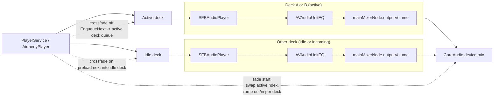
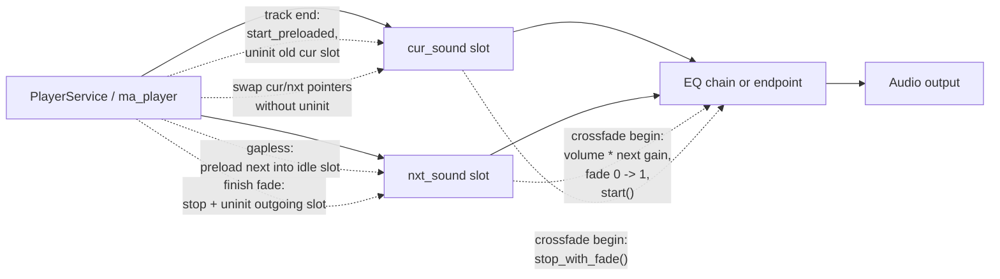
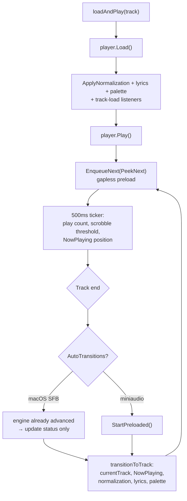
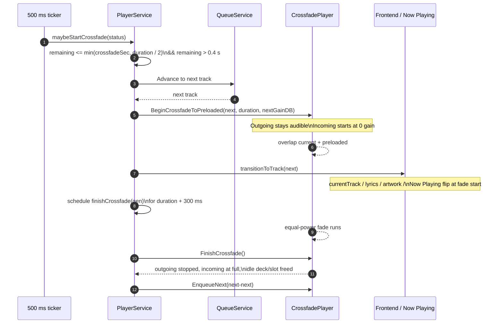
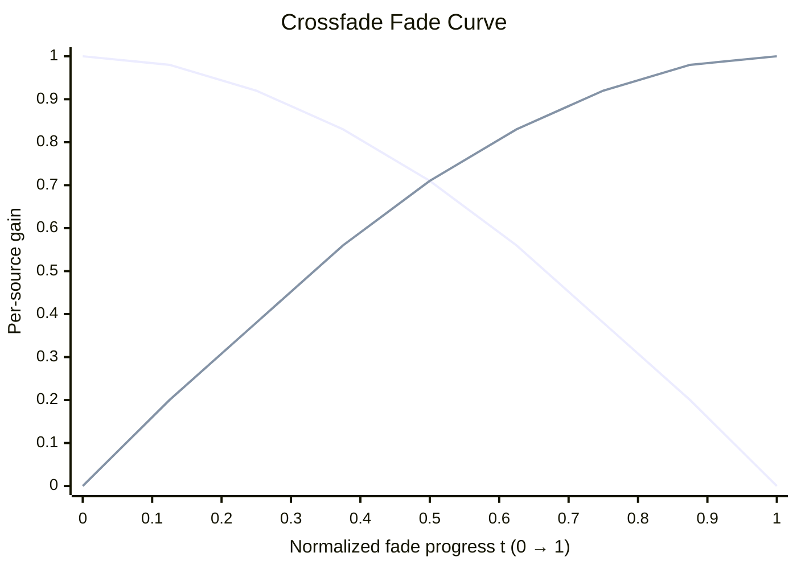

# Audio Player

## Summary

The player feature handles audio playback, queue management, shuffle/repeat modes, state persistence across app restarts, and OS-level media integration (macOS Now Playing, Windows System Media Transport Controls + taskbar thumbnail toolbar, Linux MPRIS). It is split between an application-layer service and platform-specific audio adapters.

## Files

| File                                       | Purpose                                  |
| ------------------------------------------ | ---------------------------------------- |
| `internal/app/player/player_service.go`    | Orchestration: load, play, state, events |
| `internal/app/player/queue_service.go`     | Queue data structure and navigation      |
| `internal/infra/audio/player_darwin.go`    | macOS SFBAudioEngine player (cgo)        |
| `internal/infra/audio/native_player_darwin.m` | Obj-C SFBAudioEngine implementation   |
| `internal/infra/audio/player_miniaudio.go` | Windows/Linux miniaudio player           |
| `internal/infra/audio/nowplaying.go`       | `nowPlayingBackend` interface + `MiniAudioPlayer` delegation (`//go:build windows \|\| linux`) |
| `internal/infra/audio/nowplaying_windows.go` | Windows backend factory → `smtcBackend` |
| `internal/infra/audio/nowplaying_linux.go` | Linux MPRIS (D-Bus) backend (`mprisBackend`) |
| `internal/infra/audio/player_nowplaying_windows.go` | Windows `smtcBackend`: cgo bridge to SMTC |
| `internal/infra/audio/smtc_windows.cpp`    | WinRT SMTC implementation (C-ABI, mingw)  |
| `internal/infra/audio/smtc_windows.h`      | C-ABI bridge for the SMTC backend         |
| `internal/infra/wails/player_service.go`   | Wails binding wrapper                    |
| `internal/app/normalization/service.go`    | Volume normalization: per-track pre-amp gain compute + push (see `catalog/normalization/README.md`) |
| `internal/infra/wails/normalization_service.go` | Wails binding wrapper for normalization settings |
| `internal/infra/wails/thumbbar_manager_windows.go` | `ThumbBarManager`: wires taskbar thumbnail buttons → player (`//go:build windows`) |
| `internal/infra/wails/thumbbar_manager_other.go` | No-op `ThumbBarManager` stub (non-Windows) |
| `internal/infra/wails/thumbbar_windows.cpp` | `ITaskbarList3` thumbnail-toolbar impl (GDI icons, subclass WndProc) |
| `internal/infra/wails/thumbbar_windows.h`  | C-ABI bridge for the thumbnail toolbar    |
| `internal/infra/power/inhibitor_darwin.go` | macOS IOPMAssertion sleep inhibitor (cgo) |
| `internal/infra/power/inhibitor_windows.go` | Windows SetThreadExecutionState sleep inhibitor |
| `internal/infra/power/inhibitor_linux.go`  | Linux no-op sleep inhibitor              |
| `internal/infra/power/module.go`           | FX module for `SleepInhibitor` binding   |

## AudioPlayer Interface

```go
type AudioPlayer interface {
    Play() error
    Pause() error
    Stop() error
    Seek(position float64) error
    SetVolume(volume float64) error
    SetMuted(muted bool) error
    Load(track *TrackDTO) error
    Unload() error
    GetStatus() PlayerStatus
    OnTrackEnd(callback func())
}
```

## GaplessPlayer Interface (Optional)

Implemented by audio adapters that support gapless or near-gapless transitions. Detected via type assertion in `PlayerService`.

```go
type GaplessPlayer interface {
    // Pre-load / pre-queue the next track while the current one plays.
    EnqueueNext(track *TrackDTO) error
    // Promote the pre-loaded track to active. For auto-transition players (SFBAudioEngine)
    // this updates Go-side status tracking only. For miniaudio this calls ma_player_start_preloaded.
    StartPreloaded(track *TrackDTO) error
    // Returns true when the engine transitions automatically (SFBAudioEngine).
    // HandleTrackEnd must NOT call Load/Play when this returns true.
    AutoTransitions() bool
    // ClearEnqueued discards the pending pre-queued track from the engine without
    // affecting the currently playing track. Called by PlayerService.resyncPreQueue
    // to re-sync the pre-queue whenever a queue mutation changes what track
    // immediately follows the currently-playing one.
    ClearEnqueued()
}
```

Both `DarwinPlayer` (macOS) and `MiniAudioPlayer` (Win/Linux) implement `GaplessPlayer`.

## CrossfadePlayer Interface (Optional)

Extends `GaplessPlayer` for adapters that can overlap the current track with the
pre-loaded next track under a volume ramp. Detected via type assertion in
`PlayerService`; both platform adapters implement it.

```go
type CrossfadePlayer interface {
    GaplessPlayer
    // Fade length in seconds. 0 disables crossfade and restores pure gapless
    // behavior, including where EnqueueNext pre-loads to (see below).
    SetCrossfadeDuration(seconds float64)
    // Start the pre-loaded track overlapped with the current one, ramping
    // current→0 and preloaded→full over durationSec. preampGainDB is the
    // incoming track's normalization gain, applied per-source. Updates player
    // status to the new track.
    BeginCrossfadeToPreloaded(track *TrackDTO, durationSec, preampGainDB float64) error
    // Force-complete an in-progress fade: outgoing source stopped and
    // unloaded, incoming snaps to full, idle slot freed. No-op when not fading.
    FinishCrossfade()
}
```

The crossfade duration is `AppSettings.CrossfadeSeconds` (0–`domain.MaxCrossfadeSeconds` = 12,
0 = off/default), persisted in `app_settings.crossfade_seconds` and pushed live via an
`appsettings` change listener in `internal/app/module.go` →
`PlayerService.SetCrossfadeSeconds` (initial value loaded in `restoreState`).

**Preload placement is mode-dependent on macOS:** with crossfade off,
`EnqueueNext` targets the active deck's SFB queue (engine auto-transition);
with crossfade on it targets the idle deck. `SetCrossfadeSeconds` therefore
re-syncs the pre-queue (`ClearEnqueued` + re-`EnqueueNext`) on every 0↔N change.
`DarwinPlayer.AutoTransitions()` is dynamic: `true` only when crossfade is off.

## NowPlayingController Interface (Optional)

Implemented by audio adapters that provide OS-level Now Playing info and media-key
remote commands. Detected via type assertion in `PlayerService` (constructor); when present,
the service wires remote callbacks and calls the update methods on track load, the 500ms
ticker, and stop.

```go
type NowPlayingController interface {
    SetupRemoteCommands()
    SetRemoteCallbacks(play, pause, next, previous func(), seek func(float64))
    UpdateNowPlaying(track *TrackDTO, position float64, artworkPath string)
    UpdateNowPlayingPosition(position float64)
    ClearNowPlaying()
}
```

Implemented by `DarwinPlayer` (macOS, `MPNowPlayingInfoCenter`) directly, and by
`MiniAudioPlayer` (Windows + Linux). On Win/Linux `MiniAudioPlayer` does not talk to the OS
itself — it delegates to a `nowPlayingBackend` (`nowplaying.go`) selected per platform:
`smtcBackend` (SMTC) on Windows, `mprisBackend` (MPRIS/D-Bus) on Linux. The factory
`newNowPlayingBackend` may return nil when the OS integration is unavailable (e.g. no D-Bus
session bus), in which case every delegated call is a no-op.

### Playback state (play/pause glyph)

The `domain.NowPlayingPlaybackState` interface (`SetNowPlayingPlaybackState(playing bool)`) and
`PlayerService.setNowPlayingPlaybackState` still exist but currently have **no implementer** — the
type assertion always fails, so the service hook is a no-op on every platform. Play/pause state
is instead pushed where the engine state actually flips:

- **Win/Linux:** `MiniAudioPlayer.Play/Pause/Stop` call `np.setPlaybackState(domain.PlaybackState)`
  on the backend, which drives the OS glyph (SMTC `PlaybackStatus` / MPRIS `PlaybackStatus`).
- **macOS:** `DarwinPlayer` derives the glyph from its own engine's `isPlaying`.

## NormalizationController Interface (Optional)

Implemented by audio adapters that support a pre-amp gain stage independent of
user volume, used by Volume Normalization (`internal/app/normalization`). Detected
via type assertion in `NormalizationService`, same pattern as `EQController`.

```go
type NormalizationController interface {
    SetPreampGain(db float64) error
}
```

| Platform | Mechanism |
| -------- | --------- |
| macOS    | `AVAudioUnitEQ.globalGain` (dB) on the **active deck's** persistent EQ node, applied after all bands. `SetEQEnabled` bypasses each **band** individually rather than the whole unit, so this stays independent of EQ on/off — a whole-unit `bypass` would silence `globalGain` too. Per-source: during a crossfade the incoming deck receives its own track's gain via `BeginCrossfadeToPreloaded`. |
| Windows/Linux | Per-sound: the active `ma_sound`'s volume is `user_volume × 10^(dB/20)` (`preamp_cur_linear` in the wrapper). Equivalent to the former endpoint-volume stage for a single sound, but correct during a crossfade where two overlapping sounds each keep their own track's gain (the outgoing sound's factor is preserved as `preamp_nxt_linear`). |

`ApplyToPlayer(ctx, track, next *domain.TrackDTO)` is called from every place
`PlayerService` changes the current track — `loadAndPlay` (right after
`player.Load()` and before `player.Play()`, so gain is set before audio starts),
`transitionToTrack` (gapless auto-advance), and `restoreState` (app boot) — always
passing `s.queue.PeekNext()` as `next` for the album-mode look-ahead. See
`catalog/normalization/README.md`.

## SleepInhibitor Interface

Prevents the OS from sleeping while music plays. Defined in `internal/domain/audio.go`, implemented in `internal/infra/power/`.

```go
type SleepInhibitor interface {
    Inhibit() error  // acquire OS sleep prevention
    Release() error  // release it
}
```

| Platform | Implementation | Mechanism |
| -------- | -------------- | --------- |
| macOS    | `inhibitor_darwin.go` | `IOPMAssertion` (cgo) |
| Windows  | `inhibitor_windows.go` | `SetThreadExecutionState(ES_CONTINUOUS \| ES_SYSTEM_REQUIRED)` |
| Linux    | `inhibitor_linux.go` | no-op (returns nil) |

## Platform Adapters

### macOS — SFBAudioEngine (`player_darwin.go`)

- Implemented via **cgo** calling Objective-C bridging code (`native_player_darwin.m`).
- Audio engine: **SFBAudioEngine** (v0.12.1) — replaces AVAudioEngine + FFmpeg.
- Framework deps: `SFBAudioEngine`, `AVFoundation`, `CoreMedia`, `MediaPlayer`, `AppKit`, `CoreFoundation`, `Security`, `AudioToolbox`, `opus`, `sndfile`, `lame`, `FLAC`, `tta-cpp`, `vorbis`, `wavpack`, `mpg123`, `mpc`, `ogg`.
- SFBAudioEngine and its dependencies are dynamic xcframeworks built/downloaded by `task build:sfbaudioengine` and stored at `internal/infra/audio/sfb_libs/` (not committed; add to `.gitignore`). At runtime, the frameworks are embedded in `Contents/Frameworks/`.
- **Format support:** All formats natively — MP3, FLAC, AAC, WAV, AIFF, Opus, Vorbis, WavPack, APE, DSD, and more. No FFmpeg required on darwin.
- **Dual-deck architecture** (`native_player_darwin.m`): `AirmedyDeck` owns one `SFBAudioPlayer` + one persistent 10-band `AVAudioUnitEQ`; the `AirmedyPlayer` controller holds `decks[2]` + `activeIndex` and routes transport/position/preamp to the active deck. Two decks exist because `SFBAudioPlayer` exposes a single serial decoder queue and cannot host two simultaneous sources — during a crossfade both decks play and their `AVAudioEngine`s mix at the CoreAudio device level. Gain stages compose per deck: `setVolume:` (output AU, user volume — fanned out to both decks) × `mainMixerNode.outputVolume` (crossfade ramp) × EQ `globalGain` (per-source normalization).



- **EQ:** each deck's `AVAudioUnitEQ` (10-band parametric, ISO frequencies) is injected into its SFBAudioEngine graph via `modifyProcessingGraph:` on init and reconnected on format changes via the `reconfigureProcessingGraph:withFormat:` delegate (deck identified by the `SFBAudioPlayer*` argument). Band parameters and bypass are mirrored to **both** decks so the pre-loaded deck always carries the current EQ.
- **Normalization:** `SetPreampGain` sets `equalizer.globalGain` (dB) on the active deck — applied after all bands. `setEQEnabled` bypasses each band individually (not `equalizer.bypass` on the whole unit), keeping `globalGain` unaffected by EQ on/off.
- **Track end:** `SFBAudioPlayerDelegate audioPlayer:renderingComplete:` fires when last sample is rendered (not when decoding finishes). Forwarded to Go only from the **active** deck while not fading — a fading-out deck draining naturally is already accounted for. When a next track was pre-queued gaplessly, SFBAudioEngine is still playing; `renderingComplete:` fires for each track in the queue, allowing the Go layer to advance state without stopping audio.
- **Gapless (crossfade off):** `EnqueueNext` enqueues into the active deck with `forImmediatePlayback:NO`. SFBAudioEngine transitions seamlessly if sample rate and channel count match. `AutoTransitions()` returns `true`.
- **Crossfade (crossfade on):** `EnqueueNext` pre-loads into the stopped idle deck (`forImmediatePlayback:YES` queues the decoder without playing). `BeginCrossfadePlayer` sets the incoming deck's `globalGain`, starts it at `mainMixerNode.outputVolume = 0`, swaps `activeIndex` **at fade start** (position/status/preamp immediately target the incoming deck), and runs an equal-power ramp (outgoing `cos(t·π/2)`, incoming `sin(t·π/2)`) on a 20 ms `dispatch_source_t` timer on a private serial `fadeQueue`; all fade state is mutated only on that queue. Completion (or `FinishCrossfadePlayer`) stops and resets the outgoing deck. `StartPreloadedPlayer` is the no-overlap fallback (natural end that raced past the fade window): start idle deck at full level and swap; no-op success when crossfade is off. Format mismatch between tracks is a non-issue — each deck reconfigures its own graph. Trade-off: during the overlap there is no single in-process tap point (mixing happens at device level); a future AirPlay tap must tap post-EQ per deck and mix in software, or patch vendored SFB to host two sources in one engine.
- Provides `NowPlayingController` for OS-level media info (lock screen, menu bar).
- Remote command callbacks: Play, Pause, Next, Previous, Seek (media keys + AirPods).
- `UpdateNowPlaying(track, position, artworkPath)` — populates the macOS Now Playing widget.

### Windows/Linux — miniaudio (`player_miniaudio.go`)

- C library (`miniaudio`) integrated via cgo as the playback and output engine.
- **Decoding Backend:** Leverages FFmpeg for **all** audio formats to ensure maximum compatibility and robustness.
- Functions: `ma_player_create()`, `ma_player_play()`, `ma_player_pause()`, `ma_player_stop()`, `ma_player_seek()`, `ma_player_set_volume()`.
- Track end detected via `goMiniAudioTrackEnd()` Go callback.
- **EQ:** Implemented via a chain of 10 `ma_peak_node` filters. Enabled state routes audio through the chain before output. Support for live band updates.
- **Normalization:** `ma_player_set_preamp_gain` stores the linear factor (`preamp_cur_linear`) and applies `volume × factor` to the active `ma_sound` — per-source, so overlapping sounds during a crossfade each keep their own track's gain (`preamp_nxt_linear` preserves the outgoing sound's factor; `ma_player_set_volume` re-applies both while fading). Separate from the miniaudio fader used for crossfade ramps.
- **Gapless (near-gapless):** Uses a ping-pong slot design (`slot_a`/`slot_b`). `ma_player_preload_next` initializes the next track into the idle slot. On `HandleTrackEnd`, Go calls `ma_player_start_preloaded` which uninits the current slot and starts the pre-loaded slot — gap is only goroutine scheduling latency (~1–5 ms). `AutoTransitions()` returns `false`.
- **Crossfade:** `ma_player_begin_crossfade(duration, next_gain_db)` overlaps the two slots instead of the uninit-then-start swap: the pre-loaded sound starts with `ma_sound_set_fade_in_milliseconds(0→1)` and the outgoing sound gets `ma_sound_stop_with_fade_in_milliseconds` (fade to silence then stop — no end callback). The cur/nxt pointers swap **without** uninit (`old_fading = 1` marks that the nxt slot holds the outgoing sound). `ma_player_finish_crossfade` (and, defensively, `ma_player_load`/`ma_player_preload_next`) stops + uninits the outgoing sound and snaps the incoming fader to full. `internal_end_cb` forwards only when `pSound == cur_sound`, so an outgoing sound draining naturally during the overlap cannot double-advance the queue. Fades ride the miniaudio fader, which multiplies independently of `ma_sound_set_volume` (user volume × normalization). Crossfade calls must come from goroutines, never the audio thread.



### Windows — System Media Transport Controls (Now Playing)

On Windows the `nowPlayingBackend` is `smtcBackend` (`player_nowplaying_windows.go`,
`//go:build windows`), which bridges via cgo to `smtc_windows.cpp`.

- **Toolchain:** built with mingw-w64 GCC (not MSVC), so SMTC is reached through the WinRT
  **C-ABI** projection headers (`ABI::Windows::Media::*` vtable COM), compiled as C++. Extra
  link libs (`-lruntimeobject -lshlwapi -lshell32`) live in `cgoflags_smtc_windows.go`.
- **Static C++ runtime:** because this WinRT code is C++, the binary would otherwise depend on
  `libstdc++-6.dll` / `libgcc_s_seh-1.dll` / `libwinpthread-1.dll` (absent on a clean Windows
  machine → "libstdc++-6.dll was not found" at launch). `cgoflags_windows_amd64.go` appends
  `-Wl,-Bstatic -lstdc++ -lpthread -Wl,-Bdynamic -static-libgcc` to link these statically while
  keeping system libs dynamic. `-static-libstdc++` alone does **not** work: Go links via g++ and
  the earlier `-Wl,-Bdynamic` (for `-lmfplat` etc.) leaves the linker in dynamic mode for the
  implicit `-lstdc++`. The NSIS installer therefore bundles no runtime DLLs.
- **Threading:** a dedicated **STA thread** owns a hidden **top-level** window (0×0, never shown;
  _not_ a message-only `HWND_MESSAGE` window, which `GetForWindow` accepts but the shell never
  registers a media session for), obtains SMTC via
  `ISystemMediaTransportControlsInterop::GetForWindow`, registers the `ButtonPressed`
  and `PlaybackPositionChangeRequested` handlers, and runs a message pump. Public `Smtc*`
  functions marshal work onto that thread via `PostMessage` (heap payloads), so all COM calls
  stay on the owning apartment. Self-contained — does not use the Wails window HWND.
- **Identity:** calls `SetCurrentProcessExplicitAppUserModelID("me.misa198.airmedy")` so the OS
  attributes the media session to Airmedy.
- **Mapping:** metadata + album-art thumbnail (file:// URI) via `DisplayUpdater`; play/pause
  glyph via `PlaybackStatus` (driven by the backend's `setPlaybackState`, called from
  `MiniAudioPlayer.Play/Pause/Stop`); seek scrubber via
  `ISystemMediaTransportControls2::UpdateTimelineProperties`; media-button/seek events forwarded
  to `PlayerService` through the `goWinNowPlaying*` cgo exports.
- **"Now Playing" click → open app:** The SMTC hidden window (`g_hwnd`) handles `WM_ACTIVATE`
  — fired when Windows activates it after the user clicks the media flyout card. The handler calls
  `goWinNowPlayingActivate()` which invokes a stored Go callback set from `main.go` via
  `PlayerService.SetNowPlayingActivateCallback`. The callback calls
  `WindowService.ShowCurrent()`, which focuses the mini player if open, otherwise the main window.
  `WS_EX_NOACTIVATE` was removed from `g_hwnd` so that programmatic `SetForegroundWindow` from
  the shell correctly delivers `WM_ACTIVATE`.
- **Teardown:** `MiniAudioPlayer.Close()` (called by `PlayerService` OnStop) posts quit, drains
  queued payloads, releases interfaces, and joins the thread. Idempotent.

### Windows — Taskbar Thumbnail Toolbar (`internal/infra/wails/`)

Separate from SMTC: adds **Prev / Play-Pause / Next** buttons to the taskbar
thumbnail popup (hover preview) via `ITaskbarList3::ThumbBarAddButtons`. Lives in the
**wails adapter layer** (not `infra/audio`), wired in `main.go`.

- **Files:** `thumbbar_windows.cpp` / `.h` (C++ COM impl), `thumbbar_manager_windows.go`
  (`ThumbBarManager`, `//go:build windows`), `thumbbar_manager_other.go` (no-op stub for
  non-Windows), `cgoflags_thumbbar_windows*.go` (link libs).
- **Init timing:** `Setup()` registers a `WindowFocus` hook (`once.Do`). The hook fires on a
  goroutine, so actual init is dispatched via `application.InvokeAsync` onto the Win32 **message
  thread** — the only thread valid for `SetWindowSubclass` and COM. Uses the Wails main-window
  HWND (`mainWindow.NativeWindow()`), unlike SMTC which owns its own hidden window.
- **COM:** `CoInitializeEx(APARTMENTTHREADED)` then `CoCreateInstance(CLSID_TaskbarList)` →
  `ITaskbarList3`. `SetWindowSubclass` intercepts `WM_COMMAND` (`THBN_CLICKED`) for button clicks
  and `WM_TASKBARBUTTONCREATED` to re-add buttons after an Explorer restart.
- **Icons:** white 16×16 top-down 32bpp DIBs on transparent background (Prev/Play/Pause/Next),
  drawn with GDI `Polygon`/`Rectangle`.
- **Wiring:** buttons → `PlayerService.Previous` / `TogglePause` / `Next` (each in a goroutine to
  avoid blocking the message thread). A status listener calls `ThumbBarSetPlaying` to swap the
  play/pause icon. Clicks routed back to Go through `goThumbBar*` cgo exports.
- **Teardown:** `Stop()` (called before `stopFX()` in `main.go`) → `ThumbBarStop` removes the
  subclass and releases COM resources.

### Linux — MPRIS (Now Playing)

On Linux the `nowPlayingBackend` is `mprisBackend` (`nowplaying_linux.go`, `//go:build linux`),
pure Go over D-Bus (`github.com/godbus/dbus/v5`). No cgo.

- **Bus:** connects to the session bus and exports `org.mpris.MediaPlayer2.airmedy` at
  `/org/mpris/MediaPlayer2`, implementing the `org.mpris.MediaPlayer2` (root) and
  `org.mpris.MediaPlayer2.Player` interfaces so GNOME/KDE shells, media keys and `playerctl` can
  see and control playback. `newNowPlayingBackend` returns nil if the session bus is unavailable.
- **Mapping:** track metadata → `Metadata` property (`xesam:*` + `mpris:artUrl` file:// URI);
  play/pause → `PlaybackStatus` (driven by `setPlaybackState`); position via `mpris:length` +
  `Position`. Remote Play/Pause/Next/Previous/Seek method calls are forwarded to `PlayerService`
  via the registered callbacks; property changes are emitted as D-Bus `PropertiesChanged` signals.
- **Teardown:** `close()` releases the bus name and connection.

## PlayerService (Application Layer)

Playback + gapless transition lifecycle:



### Responsibilities

- Loads tracks into the audio adapter.
- Manages playback state transitions.
- Runs a **500ms ticker** for internal logic:
  - Increments play counts and scrobbling thresholds via `checkThreshold()`.
  - Starts the crossfade near track end via `maybeStartCrossfade()` (when enabled).
  - Updates OS-level Now Playing position via `UpdateNowPlayingPosition()`.
  - **Note:** This ticker no longer emits `player:status` every 500ms; status is only emitted on meaningful state changes (Play, Pause, Seek, Stop, Track End) to reduce IPC overhead.
- Acquires OS sleep inhibition (`domain.SleepInhibitor`) when ticker starts (playback begins); releases on ticker stop (pause/stop). Controlled by `PreventSleepWhilePlaying` setting.
- Persists and restores state via `PlayerStateRepository`.
- Increments play counts via `TrackRepository.IncrementPlayCount()`.
- Syncs artwork theme colors on track load.
- Fetches/delivers lyrics on track load.
- Resets playback position to 0 on track change to ensure clean UI transitions.
- Handles track-end → advance queue → load next.
- **Gapless playback (always on):** `loadAndPlay` pre-enqueues the next track via `GaplessPlayer.EnqueueNext` (helper `preEnqueueNext`). On `HandleTrackEnd`, the service calls `GaplessPlayer.StartPreloaded` (for non-auto-transition players) or just updates status (SFBAudioEngine auto-transitions when crossfade is off), then calls `transitionToTrack` to update currentTrack, Now Playing, palette, and lyrics without interrupting audio.
- **Pre-queue invariant:** `nextPreQueued *TrackDTO` caches the track `preEnqueueNext` last handed to the native engine; both `maybeStartCrossfade` and `HandleTrackEnd` play this cached value directly rather than re-peeking the queue, so it must always match `queue.PeekNext()` for the currently-playing track. Any mutation that can change what immediately follows the current track — `ReorderQueue`, `PlayNext`/`PlayNextTracks` (insert-after-current), `RemoveFromQueue` (non-current track), `SetShuffle`, `SetRepeatMode`, `SetCrossfadeSeconds` — calls `resyncPreQueue()`, which clears `nextPreQueued`, calls `GaplessPlayer.ClearEnqueued()`, and re-runs `preEnqueueNext()` against the post-mutation queue. `loadAndPlay` (used by `PlayTracks`/`ShuffleTracks`/`PlayQueueIndex`/`Next`/`Previous`/current-track removal) clears and rebuilds the cache unconditionally as part of the hard load. `AppendTracks` is exempt — it only grows the queue tail and never changes the immediate-next track.
- **Crossfade state machine** (active when `crossfadeSec > 0` and the player implements `CrossfadePlayer`): guarded by `fading bool` + `fadeGen int` (generation counter voiding stale completion timers).
  - *Natural trigger:* the 500 ms ticker calls `maybeStartCrossfade(status)` — fires when `remaining ≤ min(crossfadeSec, duration/2)` and `remaining > 0.4 s` (below that the normal end-callback/gapless path wins; tracks under 2 s never fade). It claims the fade, advances the queue, calls `BeginCrossfadeToPreloaded` with the incoming track's `ComputeGain`, runs `transitionToTrack` (UI flips at fade start), and schedules `finishCrossfade(gen)` via `time.AfterFunc(fade + 300 ms)`.
  - *Only the natural trigger fades.* Every manual transition — `Next`/`Previous`/`PlayQueueIndex`, plus `PlayTracks`/`ShuffleTracks`/`RemoveFromQueue` — routes through `loadAndPlay` (hard load, no fade). Crossfade fires exclusively on the automatic end-of-track queue advance.
  - *Completion:* `finishCrossfade` = native `FinishCrossfade` + pre-enqueue of the next-next track — pre-enqueueing is deferred to here because the idle deck/slot is occupied by the outgoing source until the fade ends.
  - *Interruptions:* `Pause`/`Seek` finish the fade first (`finishActiveCrossfade`); `Stop`/`loadAndPlay` snap it without re-enqueueing (`snapActiveCrossfade`), so a manual `Next`/`Previous`/`PlayQueueIndex` mid-fade snaps the overlap then hard-loads; `HandleTrackEnd` returns early while fading (belt-and-suspenders over the native guards). A mid-fade `SetCrossfadeSeconds` lets the in-flight fade complete with its captured duration.
  - *Repeat-one* fades the track into itself (the preload holds the same file in the second deck/slot); *end of queue* never triggers (no preload).
  - On successful native fade start, emits `player:artwork-crossfade` with `{ transition_id, phase: "start", from_artwork_key, to_artwork_key, duration_ms }`; it emits the matching `phase: "end"` when the fade completes or is snapped. The frontend uses this event, rather than track-status changes, so manual navigation never blends artwork.

Crossfade overlap lifecycle:



Equal-power fade curve used during crossfade:



The native adapters use an equal-power law rather than a linear fade, so the
perceived loudness stays steadier through the overlap. The outgoing source uses
`cos(t·π/2)` and the incoming source uses `sin(t·π/2)`, with `t` advancing from
0 at fade start to 1 at fade completion.
- **Volume normalization:** `loadAndPlay`, `transitionToTrack`, and `restoreState` all call `NormalizationService.ApplyToPlayer(ctx, track, s.queue.PeekNext())` to push the pre-amp gain whenever the current track changes (hard load, gapless auto-advance, and app-boot restore respectively) — `next` drives the album-mode look-ahead (see `catalog/normalization/README.md`). `ReapplyNormalization()` re-runs this for the current track when normalization settings change mid-playback (called by the Wails binding).
- **Track-load listeners:** `AddTrackLoadListener` registers callbacks fired in `loadAndPlay` right after load (same point as the normalization push). Wired centrally in `internal/app/module.go` to boost-enqueue the loaded track in the analysis pipeline (`AnalysisService.Enqueue(trackID, true)`)

### Key Methods

```go
Play() error
Pause() error
Stop() error
Next() error
Previous() error
Seek(position float64) error
SetVolume(volume float64) error
SetMuted(muted bool) error
SetShuffle(enabled bool) error
SetRepeatMode(mode RepeatMode) error
SetCrossfadeSeconds(n int)      // live crossfade duration change; re-syncs the pre-queue
PlayTracks(tracks []*TrackDTO, startIndex int) error
PlayTrackIDs(ids []string, startIndex int) error
ShuffleTracks(tracks []*TrackDTO) error
ShuffleTrackIDs(ids []string) error
PlayNext(track *TrackDTO)
PlayNextTracks(tracks []*TrackDTO)
RemoveFromQueue(trackID string)
GetStatus() PlayerStatus
GetQueue() []*TrackDTO
```

### PlayerStatus

```go
type PlayerStatus struct {
    TrackID       string
    PlaybackState PlaybackState  // "playing", "paused", "stopped"
    Position      float64        // seconds
    Duration      float64        // seconds
    Volume        float64        // 0.0–1.0
    Muted         bool
    RepeatMode    RepeatMode     // "off", "one", "all"
    Shuffle       bool
    Theme         *ThemeColors
}
```

## Queue Service

```go
type QueueService struct {
    originalList []*TrackDTO  // unshuffled order
    shuffledList []*TrackDTO  // shuffled order (Fisher-Yates)
    currentIndex int
    repeatMode   RepeatMode
    shuffle      bool
    maxSize      int          // 0 = unlimited; else caps active list length (AppSettings.MaxQueueSize)
}
```

### Navigation

| Mode          | Next behavior              | Previous behavior          |
| ------------- | -------------------------- | -------------------------- |
| RepeatModeOff | Advance index; stop at end | Retreat index; stop at 0   |
| RepeatModeAll | Advance; wrap to 0 at end  | Retreat; wrap to last at 0 |
| RepeatModeOne | Return current track again | Return current track again |

### Shuffle

Fisher-Yates shuffle. When entering shuffle mode with a playing track, the current track retains focus (its new shuffled index is tracked) but is not pinned at any fixed position.

**Shuffle state invariant:** `SetQueue` (called by `PlayTracks`/`PlayTrackIDs`) always resets shuffle to false. `ShuffleTracks`/`ShuffleTrackIDs` always sets shuffle to true. UI components must not call `SetShuffle(false)` after `playTracks` — the invariant is enforced at the queue layer.

### Insert After Current

`PlayNext(track)` / `PlayNextTracks(tracks)` inserts after the current index in both `originalList` and `shuffledList`.

### Max Queue Size

`SetMaxSize(n)` sets the cap (0 = unlimited) and immediately trims an over-cap queue; called from `PlayerService.restoreState` at startup and from a `SettingsService` change-listener (`internal/app/module.go`) so a lowered limit trims the running queue live.

Trim rule (`trimActiveToLocked`, shared by `enforceMaxSizeLocked`): drop oldest history first (indices before `currentIndex`), then — if history alone isn't enough — drop from the tail (farthest future). The current track's index is never touched as long as the target size is ≥ 1 when a current track exists.

Entry points enforce the cap differently depending on how they grow the queue:

| Method | Over-cap behavior |
| --- | --- |
| `SetQueue(tracks, startIndex)` | Truncates to the first `maxSize` tracks; `startIndex` clamped into range |
| `ShuffleTracks(tracks)` | Shuffles, then takes the first `maxSize` of the shuffled result — doubles as random sampling |
| `AppendTracks(tracks)` / `InsertListAfterCurrent(tracks)` | Incoming batch is first capped to `maxSize` (or `maxSize-1` if a current track exists, reserving its slot), then the *existing* queue is trimmed via `trimActiveToLocked` to make room before the batch is added — so newly added tracks are never the ones sacrificed |
| `Restore(...)` | Trimmed via `enforceMaxSizeLocked` after hydration, so a session saved under a higher/no limit is truncated on load |

`AppSettings.MaxQueueSize` (one of `domain.ValidMaxQueueSizes`: 100/500/1000/2000/3000, default 1000) is the source of truth; see [settings](../settings/README.md).

### Other QueueService Methods

| Method | Description |
| --- | --- |
| `SetCurrentIndex(index)` | Moves the queue pointer without modifying queue contents |
| `PeekNext() / PeekPrevious()` | Read-only lookahead — returns next/previous track without advancing the index |
| `ReorderQueue(trackIDs []string)` | Reorders the active list by ID slice; maintains current track index |
| `GetOriginalQueue()` | Returns the unshuffled `originalList` |
| `Restore(original, shuffled, currentIndex, shuffle, repeatMode)` | Bulk-sets all queue state; used on app startup to restore persisted queue |
| `UpdateTrack(track)` | Updates `IsFavorite` in-place for matching entries in both lists |

## State Persistence

On every state change, `PlayerStateRepository.Save()` writes:

```go
type PlayerState struct {
    QueueTrackIDs  []string    // JSON array
    CurrentTrackID string
    Position       float64
    Volume         float64
    Muted          bool
    Shuffle        bool
    RepeatMode     RepeatMode
}
```

On app startup, `Load()` restores queue, seeks to saved position, but does not auto-play (playback state is paused on restore).

## Events Emitted

| Event                  | When                                                   |
| ---------------------- | ------------------------------------------------------ |
| `player:status`        | On any state change (Play, Pause, Seek, Stop, Track Change) |
| `player:queue-updated` | Queue modified (insert, remove, reorder, new playlist) |
| `player:theme`         | New track loaded — artwork color palette               |
| `player:lyrics`        | New track loaded — lyrics object (may be null)         |
| `player:artwork-crossfade` | Automatic audio crossfade begins/ends; fullscreen artwork transition payload |

## Frontend Store (`stores/player.ts`)

**State:** `status`, `queue`, `currentTrack`, `theme`, `lyrics`, `artworkCrossfade`, `playerMode` (`sticky | mini | fullscreen`), drawer visibility flags.

**Playback Interpolation:**
To ensure smooth 60fps progress updates and reduce IPC overhead, the store uses a **Sync-and-Drift** mechanism:
- **Sync:** Listens for `player:status` from the backend to get the authoritative position (`lastSyncPosition`) and records the arrival time (`lastSyncTime` via `performance.now()`).
- **Drift (Interpolation):** Runs a `requestAnimationFrame` loop that calculates the current position as: `lastSyncPosition + (performance.now() - lastSyncTime) / 1000`.
- The `position` computed property returns this interpolated value, providing silky smooth progress bar movement without constant backend ticking.

**Computed:** `isPlaying`, `isPaused`, `progressPercent`, `artworkUrl`, `artworkUrlMd`, `artworkUrlSm`.

**Artwork URLs:** Constructed from `artworkKey` using variant naming: `{key}_sm.jpg` (64px), `{key}_md.jpg` (500px), `{key}.jpg` (original).

When `BlendArtworkDuringCrossfade` is on (default), `FullScreenPlayer` keeps the outgoing cover below the preloaded incoming cover and advances both layers with the same equal-power curve as audio: outgoing opacity `cos(t*pi/2)`, incoming opacity `sin(t*pi/2)`. The incoming layer uses `plus-lighter` compositing so both weights contribute visually over the event's exact effective audio fade duration. This is fullscreen-only; player bars and mini players switch immediately. Disabling the setting settles an active transition on the incoming cover.

Fullscreen lyrics have two separate panel components selected by `HighContrastLyrics` (default true). `PlayerLyricsPanel` is the existing glass, bordered, headered high-contrast panel. `ImmersiveLyricsPanel` renders the same parsed/synced lyric content directly over the living artwork background without a background, border, shadow, or header. This setting does not affect `LyricsDrawer` or the mini player.

In the fullscreen left column, `PlayerArtwork` is offset upward by `0.5rem` relative to the track-info block so the cover sits slightly higher without changing the controls layout.

**Player modes:**

- `sticky` — Full player footer pinned at bottom.
- `mini` — Floating mini player window (separate Wails window, always-on-top).
- `fullscreen` — Full-screen overlay in the main window.

## Wails-Exposed Methods

```typescript
Play(), Pause(), Stop()
Next(), Previous()
Seek(position: number)
SetVolume(volume: number)
SetMuted(muted: boolean)
SetShuffle(enabled: boolean)
SetRepeatMode(mode: string)
PlayTracks(tracks: TrackDTO[], startIndex: number)
PlayTrackIDs(trackIDs: string[], startIndex: number)
ShuffleTracks(tracks: TrackDTO[])
ShuffleTrackIDs(trackIDs: string[])
PlayNext(track: TrackDTO)
PlayNextTracks(tracks: TrackDTO[])
RemoveFromQueue(trackID: string)
GetStatus(): PlayerStatus
GetQueue(): TrackDTO[]
```

## Mini Player Window

Separate Wails window (default 300×300, min 280×180, max 500×500). Route: `/mini-player`. Artwork fills the window; hover-revealed controls sit over a CSS glassmorphism panel (`backdrop-filter` blur, bottom→top mask fade — see `catalog/ui`). Has always-on-top toggle and volume slider with auto-fade timer.

### Geometry & Pin Persistence

`WindowService` persists the mini player's position, size, and pin (always-on-top) state to the single-row `mini_player_state` table (`MiniPlayerStateRepository`), so they survive close/reopen and app restarts. The window is recreated on each open (see `catalog/ui`), so restore happens in the factory:

- **Restore** — `WindowService.ApplyMiniState(w)` runs in the mini window factory before show. If `has_position` is set, it applies the saved bounds (clamped, see below) and re-applies `always_on_top`.
- **Capture** — `WindowDidMove`/`WindowDidResize` hooks call `WindowService.SaveMiniGeometry()`, which reads `w.Bounds()` and persists it debounced (~400ms) to coalesce drag/resize streams. `WindowClosing` flushes a final save.
- **Pin** — frontend calls `WindowService.SetMiniAlwaysOnTop(b)` (not `Window.SetAlwaysOnTop` directly) so the toggle is persisted immediately. On mount the component reads `WindowService.GetMiniState()` to render the correct pin icon.
- **Screen-aware clamp** — `clampToScreen` clamps width/height into `[280..500]`×`[140..500]`, then positions the window and reads its screen's `WorkArea` (via `w.GetScreen()`); the pure helper `clampRectToWorkArea` shrinks/moves the rect fully inside the work area. This keeps the window reachable after a layout change (lower resolution, disconnected monitor, different screen).
