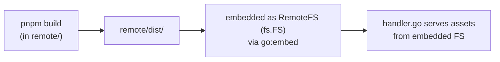

# Remote Control

## Summary

The remote control feature exposes a LAN HTTP + WebSocket server that lets any browser on the same network control Airmedy playback. A built-in Vue 3 SPA is served from the same server. Clients authenticate with a 4-digit PIN; subsequent reconnections use a stored session token. All playback state changes are broadcast to every connected client in real time.

## Files

### Backend (`internal/app/remoteserver/`)

| File | Purpose |
| ---- | ------- |
| `handler.go` | HTTP router + WebSocket upgrade; auth handshake; routes commands to channel |
| `service.go` | Server lifecycle (start/stop/port selection); command processing loop; state listeners |
| `hub.go` | Fan-out broadcast to all authenticated WebSocket clients |
| `session.go` | PIN authentication; UUID session tokens; password change invalidates all sessions |
| `messages.go` | JSON message type constants; `InboundMessage` struct; all outbound message structs |
| `module.go` | FX dependency injection wiring |

### Frontend (`remote/src/`)

| File | Purpose |
| ---- | ------- |
| `main.ts` | Vue app bootstrap; fetches `/api/settings` for language before mount |
| `ws.ts` | WebSocket client; reconnect with exponential backoff; TS message type definitions |
| `stores/player.ts` | Pinia store: auth state, connection state, player status, queue, lyrics |
| `App.vue` | Root layout; 1-column (mobile) vs 2-column (desktop) responsive split |
| `components/Auth.vue` | 4-digit PIN input screen |
| `components/PlayerView.vue` | Now-playing section container |
| `components/NowPlaying.vue` | Artwork, track info, seek bar |
| `components/PlayerControls.vue` | Play/pause, next/prev, shuffle, repeat, volume |
| `components/QueueView.vue` | Queue panel container |
| `components/Queue.vue` | Scrollable track list (virtual scroller) |
| `components/PlayingBar.vue` | Animated playing indicator |
| `components/MarqueeText.vue` | Horizontal scrolling for long text |
| `components/ui/slider/Slider.vue` | Seek and volume draggable slider |

## HTTP Endpoints

| Method | Path | Purpose |
| ------ | ---- | ------- |
| `GET` | `/ws` | Upgrade to WebSocket (all control and state sync) |
| `GET` | `/api/settings` | Returns `{ "language": string }` for i18n |
| `GET` | `/artwork/{key}` | Serve cached artwork; `?size=sm\|md` for variants |
| `GET` | `/*` | Serve built SPA; SPA fallback to `index.html` |

## WebSocket Protocol

All messages are JSON objects with a `type` field.

### Inbound (Client → Server)

```go
type InboundMessage struct {
    Type     string   `json:"type"`
    Password string   `json:"password,omitempty"`  // 4-digit PIN for auth
    Token    string   `json:"token,omitempty"`     // stored session token for re-auth
    Position float64  `json:"position,omitempty"`  // seek position (seconds)
    Volume   float64  `json:"volume,omitempty"`    // 0.0–1.0
    Muted    bool     `json:"muted,omitempty"`
    Enabled  bool     `json:"enabled,omitempty"`   // shuffle on/off
    Mode     string   `json:"mode,omitempty"`      // repeat mode: "off"|"one"|"all"
    Index    int      `json:"index,omitempty"`     // queue index
    TrackID  string   `json:"track_id,omitempty"`
    TrackIDs []string `json:"track_ids,omitempty"` // reorder sequence
}
```

| `type` | Required fields | Action |
| ------ | --------------- | ------ |
| `auth` | `password` or `token` | Authenticate connection |
| `play` | — | Resume playback |
| `pause` | — | Pause playback |
| `toggle_pause` | — | Toggle play/pause |
| `next` | — | Skip to next track |
| `prev` | — | Go to previous track |
| `seek` | `position` | Seek to position (seconds) |
| `set_volume` | `volume` | Set volume 0.0–1.0 |
| `set_muted` | `muted` | Mute/unmute |
| `set_shuffle` | `enabled` | Enable/disable shuffle |
| `set_repeat` | `mode` | Set repeat mode |
| `play_queue_index` | `index` | Play track at queue index |
| `remove_from_queue` | `track_id` | Remove track from queue |
| `reorder_queue` | `track_ids` | Reorder queue by ID slice |

### Outbound (Server → Client)

```go
// auth_required — sent immediately on connection
type AuthRequired struct { Type string }

// auth_ok — sent on successful auth; includes full initial state
type AuthOk struct {
    Type  string `json:"type"`
    Token string `json:"token"`
    State AuthOkState `json:"state"`
}
type AuthOkState struct {
    TrackMetadata domain.PlayerTrackMetadata `json:"track_metadata"`
    PlayerState   domain.RemotePlayerState   `json:"player_state"`
    Queue         []*domain.TrackDTO         `json:"queue"`
}

// auth_failed
type AuthFailed struct { Type string; Reason string }

// track_metadata — sent on track switch and after theme (palette) extraction
type TrackMetadataMessage struct { Type string; Data domain.PlayerTrackMetadata }

// player_state — sent on explicit user interactions (play/pause/seek/volume/etc.)
type PlayerStateMessage struct { Type string; Data domain.RemotePlayerState }

// queue — queue updated
type QueueMessage struct { Type string; Data []*domain.TrackDTO }

// lyrics — current track lyrics
type LyricsMessage struct { Type string; Data *domain.Lyric }

// error
type ErrorMessage struct { Type string; Message string }
```

#### `PlayerTrackMetadata` (low-frequency, track switches only)

```typescript
interface PlayerTrackMetadata {
  track_id: string
  duration: number        // seconds
  theme: ThemeColors | null
}
```

#### `RemotePlayerState` (event-driven, on explicit user interactions)

```typescript
interface RemotePlayerState {
  playback_state: 'playing' | 'paused' | 'stopped'
  position: number        // seconds — baseline; client interpolates locally
  volume: number          // 0.0–1.0
  muted: boolean
  repeat_mode: 'off' | 'one' | 'all'
  shuffle: boolean
}
```

#### `ThemeColors`

```typescript
interface ThemeColors {
  vibrant: string   // hex
  muted: string     // hex
  dominant: string  // hex
}
```

#### `TrackDTO`

```typescript
interface TrackDTO {
  id: string
  path: string
  title: string
  duration: number
  artwork_key: string
  artists?: Artist[]
  album?: Album
  album_artists?: Artist[]
}
```

## Authentication & Sessions

1. Client connects → server sends `auth_required`
2. Client sends `auth` with `password` (PIN) or `token` (from `localStorage`)
3. Server validates:
   - **PIN:** `subtle.ConstantTimeCompare` against stored password → issues UUID token
   - **Token:** `SessionStore.Validate` → updates `LastSeen`
4. Success → `auth_ok` with token + full player state; client stores token as `airmedy_remote_token` in `localStorage`
5. Failure → `auth_failed` with reason; client clears stored token

**Timeouts:**
- Auth window: 5 minutes (time to read and type PIN)
- WS write: 10 seconds per write
- `SetPassword()` clears all sessions; next connection requires PIN

## Command Pipeline

```
PlayerControls.vue / Queue.vue
  ↓  send({ type, ... })
ws.ts — WebSocket.send()
  ↓
handler.go — handleWS() read loop
  ↓  h.commands <- msg
service.go — processCommands() goroutine
  ↓  handleCommand(msg)
player.PlayerService — Play/Pause/Seek/etc.
```

## State Broadcast

`service.go` registers four listeners on `PlayerService` at server start. Each listener marshals a message and calls `hub.BroadcastMessage`, which fan-outs to all authenticated clients.

```go
playerSvc.AddTrackMetadataListener(func(meta PlayerTrackMetadata) {
    hub.BroadcastMessage(TrackMetadataMessage{Type: TypeTrackMetadata, Data: meta})
})
playerSvc.AddRemoteStateListener(func(state RemotePlayerState) {
    hub.BroadcastMessage(PlayerStateMessage{Type: TypePlayerState, Data: state})
})
playerSvc.AddQueueListener(func(queue []*TrackDTO) {
    hub.BroadcastMessage(QueueMessage{Type: TypeQueue, Data: queue})
})
playerSvc.AddLyricsListener(func(lyric *Lyric) {
    hub.BroadcastMessage(LyricsMessage{Type: TypeLyrics, Data: lyric})
})
```

**Position updates:** The backend no longer broadcasts position on a 500 ms ticker. On `player_state` receipt, the frontend stores `position` as a baseline with a `Date.now()` timestamp and increments `localPosition` via `setInterval(250ms)`. The timer stops when `playback_state` is not `"playing"`.

`Hub` maintains a `map[*Client]bool` under a mutex. Each `Client` has a buffered `send chan []byte` (size 256). The write pump goroutine (in `handleWS`) drains the channel.

## Frontend Store (`stores/player.ts`)

```typescript
// State
authState:    'idle' | 'required' | 'authenticated' | 'failed'
connected:    boolean
connecting:   boolean
reconnecting: boolean
queue:        TrackDTO[]
lyrics:       Lyric | null

// Internal (not exported)
trackMetadata: PlayerTrackMetadata | null
remoteState:   RemotePlayerState | null
localPosition: number  // interpolated by 250ms setInterval while playing

// Computed
status       // PlayerStatus | null — unified shape merging trackMetadata + remoteState + localPosition
currentTrack // TrackDTO matching trackMetadata.track_id, or null
artworkUrl(key, size?)  // → /artwork/{key}?size={size}  (default size: "md")

// Mutators
setAuthState / setConnected / setConnecting / setReconnecting
applyTrackMetadata / applyRemoteState / applyQueue / applyLyrics

// Lifecycle
dispose()  // stops progress timer; call on app unmount
```

## WebSocket Reconnection

`ws.ts` reconnects with exponential backoff starting at 1 s, capped at 30 s. On reconnect, the stored token is sent immediately so the user does not need to re-enter the PIN. If `authState` is `required` at disconnect time (no token), reconnect is silent (no reconnecting spinner).

## Build & Embed



Port is selected from the dynamic range 49152–65535, cached in `AppSettings.RemoteServerPort`. If the cached port is unavailable, a new random port is chosen and persisted.
