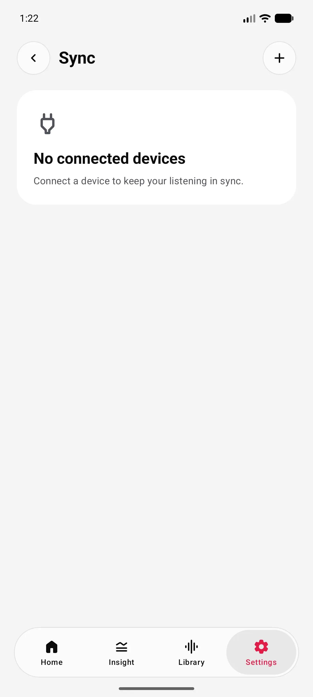
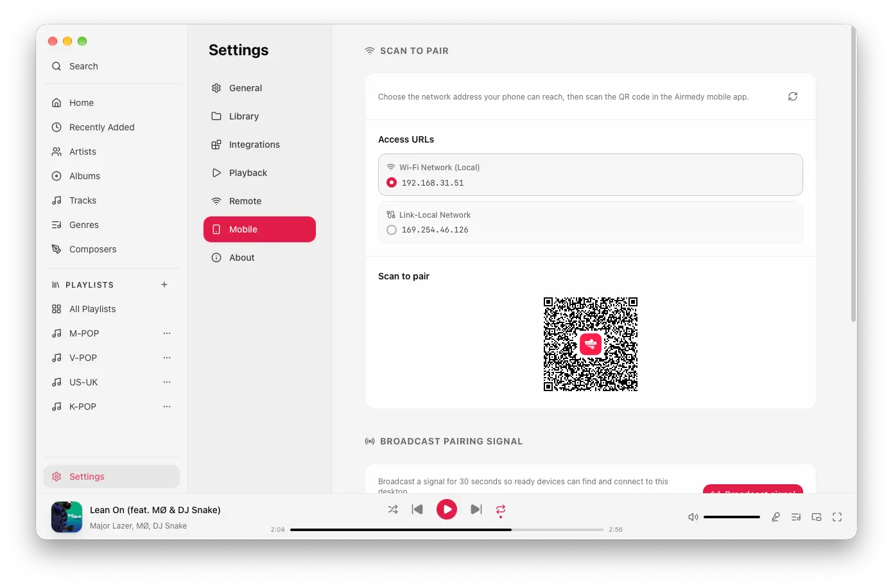
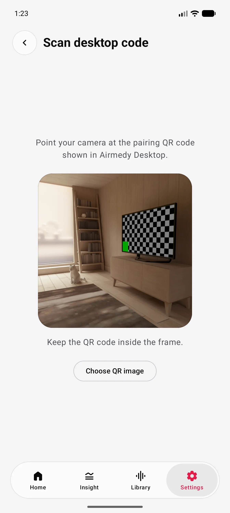
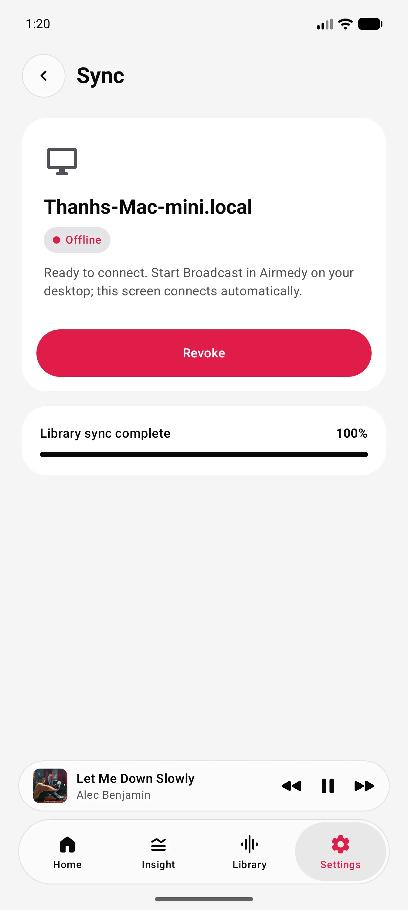
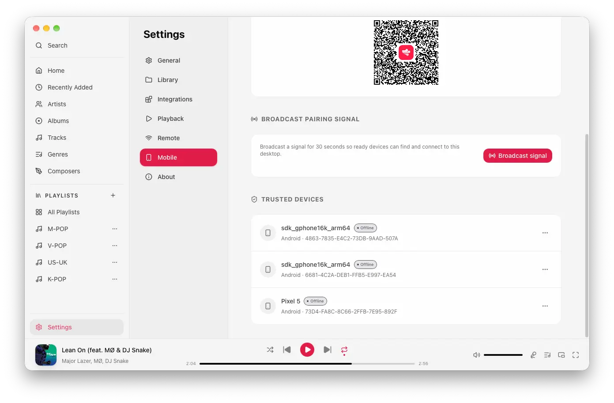
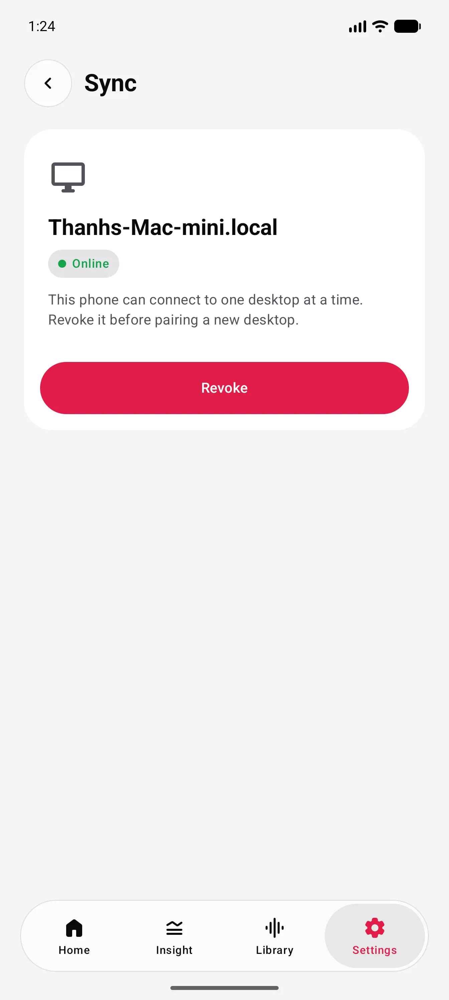
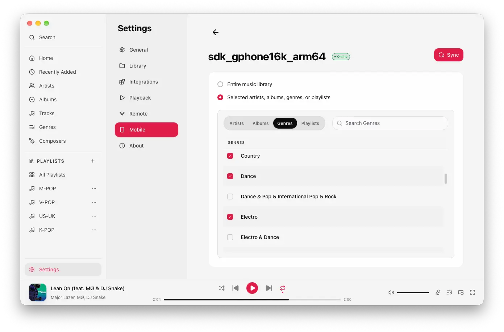
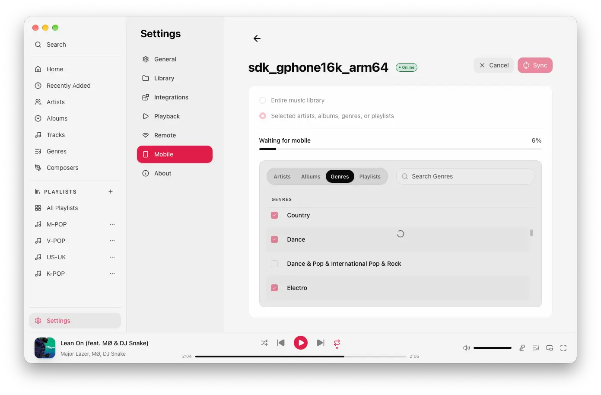
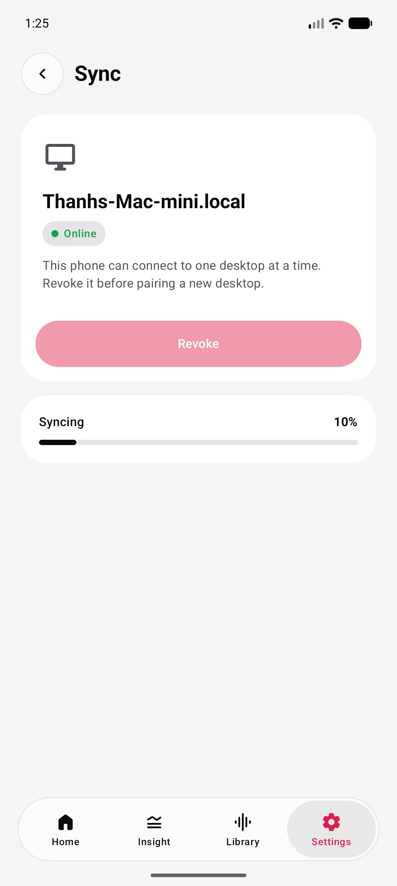

# How do I sync my mobile device?

## Connect your phone for the first time

1. Make sure your desktop and phone are on a network they can both reach.
2. On desktop, open **Settings → Mobile**. Select the reachable network address before scanning the QR code. Use Wi-Fi when both devices share Wi-Fi, or Ethernet when the desktop is wired to the same LAN. Avoid VPN, virtual, and link-local addresses unless the phone uses that exact network.
3. On your phone, open **Settings → Sync**, select **Add device**, then scan the desktop QR code. Allow camera access if prompted.
4. Approve the pairing request in Airmedy on desktop.

<em>Open Sync and add a device.</em>

<em>Choose the reachable network, then scan its QR code.</em>

<em>Scan the pairing QR code.</em>

## Reconnect a trusted device

When a phone is already trusted, opening Airmedy Mobile reconnects it automatically if Airmedy desktop is running and reachable. If it stays offline, keep its Sync screen open and select **Broadcast signal** in **Settings → Mobile** on desktop. The phone reconnects during the 30-second broadcast window.

<em>Keep the offline Sync screen open.</em>

<em>Broadcast the pairing signal from desktop.</em>

<em>Your trusted desktop is online again.</em>

## Sync your library

1. In desktop **Settings → Mobile**, select an online phone.
2. Choose the entire library, or selected artists, albums, genres, or playlists.
3. Select **Sync** and follow the progress on desktop or mobile.

<em>Choose what to sync.</em>

<em>Follow progress on desktop.</em>

<em>Or follow progress on your phone.</em>
